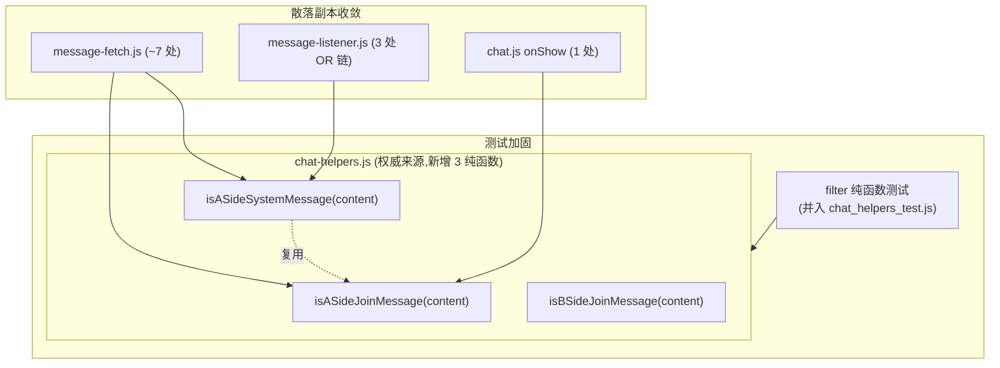
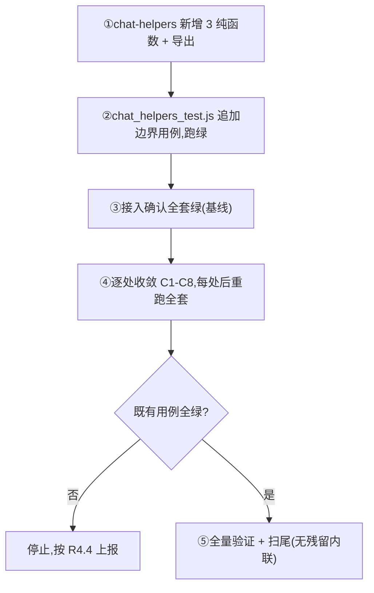

# Design Document

## Overview

本设计为 `system-message-filter-hardening` 规格的技术方案,沿用 title-display-hardening 已验证的同构手法:**抽取权威纯函数 → 纯函数级测试固化语义 → 逐处收敛散落副本**,以"业务行为零变化"为硬约束。

治理对象是两个在消息拉取/监听核心数据路径上被完整复制粘贴的判定:

1. **A 端加入格式判定**:`/^.+加入聊天$/.test(c) && !/^加入.+的聊天$/.test(c)`(区分 A 端"XX加入聊天" vs B 端"加入XX的聊天")
2. **A 端系统消息识别**:`includes('您创建了私密聊天') || includes('可点击右上角菜单分享链接邀请朋友加入') || includes('私密聊天已创建') || includes('分享链接邀请朋友') || (includes('创建') && includes('聊天')) || [A端加入格式]`

### 关键前置发现:各副本 OR 条件完全一致

精确比对 message-fetch.js(L135 区)、message-listener.js(L83 区、L212 区、L309 区)的"A 端系统消息识别"OR 链,**5 个创建文案项 + A 端加入格式项完全一致**,是干净的复制粘贴。因此:

- **R2.7 / R3.5 的"差异"风险不存在**——并集 = 每个副本,收敛对这些路径**行为零变化**(全部 Tier A)。
- 唯一需注意的是:`message-fetch.js` L135 区的 `isASideSystemMessage` 判定**嵌在 `if (msg.isSystem && msg.content)` 内**,而权威函数只判 content;收敛时须保留外层 `isSystem` 守卫,不把它并进纯函数。

### A 端加入格式判定的分布

`/^.+加入聊天$/.test(c) && !/^加入.+的聊天$/.test(c)` 独立出现(不在 A 端系统消息 OR 链内)的位置:
- chat.js onShow 清理(L1661)
- message-fetch.js:L141(B端过滤内,作为 shouldFilterForBSide 一项,已属 A端系统消息识别)、L190 / L213(isCorrectFormat 判定)、L234(合并过滤)、L513(B端 setData 前过滤)、L599(B端最终防线)
- message-listener.js:已在 A 端系统消息 OR 链内,无独立出现

注意:`isCorrectFormat` 的语义是"保留正确格式",其中 A 端分支 `(/^.+加入聊天$/ && !/^加入.+的聊天$/) || includes('您创建了私密聊天')` —— 前半段正是 `isASideJoinMessage`,可收敛;后半段是创建文案单项,保留或一并用 `isASideSystemMessage` 需逐处判断语义等价性。

## Architecture



### 设计原则

- **纯函数零副作用**:3 个函数仅依赖 content 入参,非字符串安全返回 false。
- **语义精确等价**:`isASideSystemMessage` 的 OR 项严格等于现状副本(5 创建文案 + `isASideJoinMessage`),不增不减。
- **守卫保留**:收敛时保留各处外层守卫(如 `msg.isSystem &&`、`isFromInvite &&`),只替换"判定内容格式"的内联部分。
- **测试先行**:先建纯函数 + 测试固化,再收敛;既有 843 PASS(尤其 message-fetch 35 / message-listener 31)作为回归网。

## Components and Interfaces

### 组件 1:Format_Detector(chat-helpers.js 新增 3 纯函数)

```javascript
/**
 * 是否为 A 端加入格式"XX加入聊天"(非 B 端"加入XX的聊天")
 * @param {string} content
 * @returns {boolean}
 */
function isASideJoinMessage(content) {
  if (!content || typeof content !== 'string') return false;
  return /^.+加入聊天$/.test(content) && !/^加入.+的聊天$/.test(content);
}

/**
 * 是否为 B 端加入格式"加入XX的聊天"
 * @param {string} content
 * @returns {boolean}
 */
function isBSideJoinMessage(content) {
  if (!content || typeof content !== 'string') return false;
  return /^加入.+的聊天$/.test(content);
}

/**
 * 是否为 A 端专属系统消息(B 端应过滤)。语义 = 现状各副本 OR 链的并集:
 * 5 类创建文案 + A 端加入格式。
 * @param {string} content
 * @returns {boolean}
 */
function isASideSystemMessage(content) {
  if (!content || typeof content !== 'string') return false;
  return (
    content.includes('您创建了私密聊天') ||
    content.includes('可点击右上角菜单分享链接邀请朋友加入') ||
    content.includes('私密聊天已创建') ||
    content.includes('分享链接邀请朋友') ||
    (content.includes('创建') && content.includes('聊天')) ||
    isASideJoinMessage(content)
  );
}
```

新增到 `chat-helpers.js` 的 `module.exports`。

### 组件 2:Filter_Regression_Suite(并入 chat_helpers_test.js)

**决策(R5.4):并入 `chat_helpers_test.js` 而非新建文件**。理由:
- 这 3 个函数是 chat-helpers 的纯函数,与既有 `isPlaceholderJoinMessage` / `isSystemLikeMessage` 同类同位置,并入更内聚;
- 避免测试文件数膨胀(19 个已不少);
- chat_helpers_test.js 已有成熟的 assert/assertEqual 骨架,直接追加用例段即可。

### 组件 3:收敛后的生产代码(不新增对外接口)

收敛只把内联判定替换为 `ChatHelpers.isASideJoinMessage(c)` / `ChatHelpers.isASideSystemMessage(c)`。message-fetch / message-listener 已 `require('./chat-helpers.js')`;chat.js 已有 `ChatHelpers` 引用。

## 收敛点盘点

| 编号 | 文件:区域 | 现状 | 收敛为 | Tier |
|---|---|---|---|---|
| C1 | message-listener.js L83 区(onChange 早期 B 端过滤) | A端系统消息 OR 链 | `isASideSystemMessage(c)` | A |
| C2 | message-listener.js L212 区(direct-add bSide) | A端系统消息 OR 链 | `isASideSystemMessage(c)` | A |
| C3 | message-listener.js L309 区(fallback docs fbIsB) | A端系统消息 OR 链 | `isASideSystemMessage(c)` | A |
| C4 | message-fetch.js L135 区(B端 shouldFilterForBSide) | A端系统消息 OR 链(外层 isSystem 守卫保留) | `isASideSystemMessage(c)` | A |
| C5 | message-fetch.js L190 / L213(isCorrectFormat A端分支) | `[A端加入格式] || includes('您创建了私密聊天')` | `isASideJoinMessage(c) || c.includes('您创建了私密聊天')` | A |
| C6 | message-fetch.js L141 / L234 / L513 / L599 | 独立 A端加入格式正则 | `isASideJoinMessage(c)` | A |
| C7 | message-fetch.js B端格式保留判定(isCorrectFormat B端分支 L186/L209) | `/^加入.+的聊天$/.test(c)` | `isBSideJoinMessage(c)` | A |
| C8 | chat.js onShow 清理 L1661 | 独立 A端加入格式正则 | `ChatHelpers.isASideJoinMessage(c)` | A |

**全部 Tier A**:因各副本语义完全一致,收敛是纯粹的"提取公共函数",理论上零行为变化。既有 message-fetch 35 / message-listener 31 用例 + 新增纯函数用例共同守护。

## Data Models

无新增数据结构。纯函数输入 `content: string`,输出 `boolean`。

## Error Handling

| 场景 | 处理 |
|---|---|
| content 为 null/undefined/非字符串 | 3 函数均 `if (!content || typeof content !== 'string') return false` |
| 收敛后既有 message-fetch/message-listener 用例变红 | 视为真实回归信号,停止收敛、按 R4.4 上报用户,禁止改期望值 |
| message-fetch L135 外层 isSystem 守卫 | 收敛时保留,不并入纯函数 |

## Testing Strategy

### 不引入 PBT

与 title 治理同理:判定是有限可枚举的格式分类,边界明确(A端格式/B端格式/5 类创建文案/普通文本/非字符串),表驱动示例 + 边界语料比随机 PBT 更精准,且项目零依赖纯 Node 约定。省略 Correctness Properties 章节。

### 测试层次

1. **纯函数边界测试(并入 chat_helpers_test.js)**:
   - `isASideJoinMessage`:"小明加入聊天"→true;"加入小明的聊天"→false;"加入聊天"(无名)→现状语义固化;普通文本→false;非字符串→false
   - `isBSideJoinMessage`:"加入小明的聊天"→true;"小明加入聊天"→false;非字符串→false
   - `isASideSystemMessage`:5 类创建文案各→true;A端加入格式→true;B端加入格式→false;普通文本→false;非字符串→false
   - 互斥性:对同一 A端加入格式,`isASideJoinMessage=true && isBSideJoinMessage=false`
2. **既有集成测试作为收敛回归网**:message-fetch 35 / message-listener 31 用例覆盖 B 端过滤路径,收敛后须保持全绿。

### 工作顺序(R4.2)



## 设计决策与理由

| 决策 | 理由 |
|---|---|
| 纯函数测试并入 chat_helpers_test.js | 同类同位置、更内聚、避免测试文件膨胀(R5.4) |
| isASideSystemMessage 内部复用 isASideJoinMessage | 与现状 OR 链结构一致,单一真相 |
| 保留各处外层守卫(isSystem/isFromInvite) | 守卫属业务路径控制,非格式判定;收敛只动格式判定部分,守卫不动以保证零行为变化 |
| 全部标 Tier A | 各副本 OR 条件精确比对后完全一致,收敛是纯提取,无边界翻转(与 title 治理的 Tier B 不同) |
| 不收敛 isCorrectFormat 的创建文案单项为整体 isASideSystemMessage | 该处语义是"A端加入格式 或 创建消息"二者之一,与 isASideSystemMessage 的并集语义不完全等价(后者还含'私密聊天已创建'等),保留单项 includes 更安全 |

## 范围决策(待用户确认 / 默认按推荐)

- **推荐**:全部 C1-C8 收敛(均 Tier A,零行为变化)。
- isCorrectFormat 分支(C5)只收敛其中的"A端加入格式"为 `isASideJoinMessage`,创建文案单项 `includes('您创建了私密聊天')` 保留原样(避免扩大语义),不强行换成整体 `isASideSystemMessage`。
