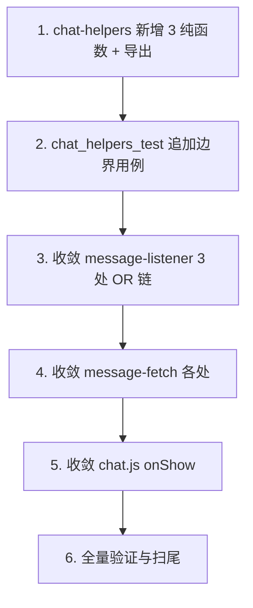

# Implementation Plan

## Overview

把"A 端加入格式判定"与"A 端系统消息识别"两个被复制粘贴到 message-fetch / message-listener / chat.js 多处的判定,抽取为 chat-helpers 的 3 个权威纯函数(isASideJoinMessage / isBSideJoinMessage / isASideSystemMessage),先用纯函数测试固化语义,再逐处收敛。各副本 OR 条件经精确比对完全一致,故全部 Tier A(收敛零行为变化),由既有 message-fetch 35 / message-listener 31 用例 + 新增纯函数用例共同守护。

> 工作顺序硬约束(R4.2):先建纯函数 + 测试固化并全绿 → 再逐处收敛 → 每处后重跑全套。既有用例变红即真实回归,停止上报,禁止改期望值。

## Task Dependency Graph



```json
{
  "waves": [
    { "wave": 1, "tasks": ["1"] },
    { "wave": 2, "tasks": ["2"] },
    { "wave": 3, "tasks": ["3"] },
    { "wave": 4, "tasks": ["4"] },
    { "wave": 5, "tasks": ["5"] },
    { "wave": 6, "tasks": ["6"] }
  ]
}
```

## Tasks

- [x] 1. chat-helpers.js 新增 3 个权威格式判定纯函数
  - 新增 isASideJoinMessage(content) / isBSideJoinMessage(content) / isASideSystemMessage(content),语义严格等于现状副本(5 创建文案 + A 端加入格式),非字符串安全返回 false,isASideSystemMessage 内部复用 isASideJoinMessage
  - 加入 module.exports
  - _需求: R1.1, R1.2, R1.3, R1.4, R1.5_

- [x] 2. chat_helpers_test.js 追加 3 纯函数边界用例并固化语义
  - isASideJoinMessage:A端格式 true / B端格式 false / 普通文本 false / 非字符串 false
  - isBSideJoinMessage:B端格式 true / A端格式 false / 非字符串 false
  - isASideSystemMessage:5 类创建文案 true / A端加入格式 true / B端格式 false / 普通文本 false / 非字符串 false
  - 互斥性断言;跑 chat_helpers_test 全绿,跑全套确认基线
  - _需求: R2.1, R2.2, R2.3, R2.4, R2.5, R2.6, R5.1, R5.3, R5.4_

- [x] 3. 收敛 message-listener.js 3 处 A 端系统消息 OR 链(C1/C2/C3)
  - L83 区 / L212 区 / L309 区的 OR 链改 ChatHelpers.isASideSystemMessage(content)
  - 重跑全套,message-listener 31 用例须全绿
  - _需求: R3.1, R3.2, R3.3, R4.1, R4.3, R4.4_

- [x] 4. 收敛 message-fetch.js 各处(C4/C5/C6/C7)
  - C4 L135 区 OR 链 → isASideSystemMessage(保留外层 isSystem 守卫)
  - C6 L141/L234/L513/L599 独立 A 端加入格式正则 → isASideJoinMessage
  - C5 L190/L213 isCorrectFormat A端分支 → isASideJoinMessage(c) || c.includes('您创建了私密聊天')(创建文案单项保留)
  - C7 L186/L209 isCorrectFormat B端分支 → isBSideJoinMessage
  - 重跑全套,message-fetch 35 用例须全绿
  - _需求: R3.1, R3.2, R3.3, R4.1, R4.3, R4.4_

- [x] 5. 收敛 chat.js onShow 清理(C8)
  - L1661 独立 A 端加入格式正则 → ChatHelpers.isASideJoinMessage(c)
  - 重跑全套确认全绿
  - _需求: R3.1, R3.3, R4.1, R4.3_

- [x] 6. 全量验证与扫尾
  - 全局搜索确认 message-fetch / message-listener / chat.js 不再保留独立 A 端加入格式正则与 A 端系统消息识别 OR 链(R3.4)
  - 跑全套确认全绿,统计 PASS 总数
  - _需求: R3.4, R4.3_

## Notes

- **测试模式**:纯函数测试并入 chat_helpers_test.js(同类同位置,避免文件膨胀);纯 Node assert/assertEqual。
- **全 Tier A**:各副本 OR 条件经精确比对完全一致,收敛是纯提取,无边界翻转(不同于 title 治理的 Tier B)。
- **守卫保留**:收敛只替换"判定内容格式"内联部分,各处外层守卫(isSystem / isFromInvite / bSide)不动。
- **C5 谨慎**:isCorrectFormat 的创建文案单项 includes('您创建了私密聊天') 保留原样,不扩为整体 isASideSystemMessage(语义不完全等价)。
- **不在范围**:不改 system-message.js 添加/淡出/去重、不改 B 端过滤产品策略、不动身份时序与云函数。
- **提交习惯**:每任务一次独立 commit,中文 message;每处收敛后重跑 run_all_tests.sh 再提交。

## 执行结果(完成)

- 权威纯函数:chat-helpers 新增 isASideJoinMessage / isBSideJoinMessage / isASideSystemMessage(并入 chat_helpers_test.js,+37 用例)。
- 收敛:message-listener 3 处 OR 链(C1-C3)、message-fetch 7 处(C4-C7)、chat.js onShow 1 处(C8),全部改调权威函数。3 个目标文件已无独立 A 端加入格式正则与 A 端系统消息识别 OR 链。
- 全 Tier A 零行为变化:各副本 OR 条件精确比对完全一致,既有 message-fetch 35 / message-listener 31 / 集成测试全绿。
- 测试套件:19 个测试,843 → 880 PASS(+37,均来自新增纯函数边界用例)。
- 保留项(设计明确):C5 isCorrectFormat 的创建文案单项 includes('您创建了私密聊天') 保留;message-fetch L497/L592 的独立单短语 B 端过滤(非 OR 链)不在范围。
