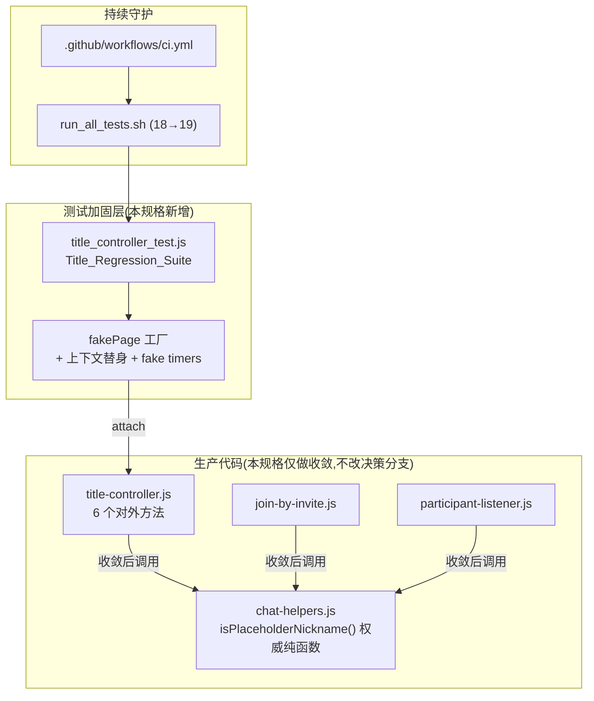
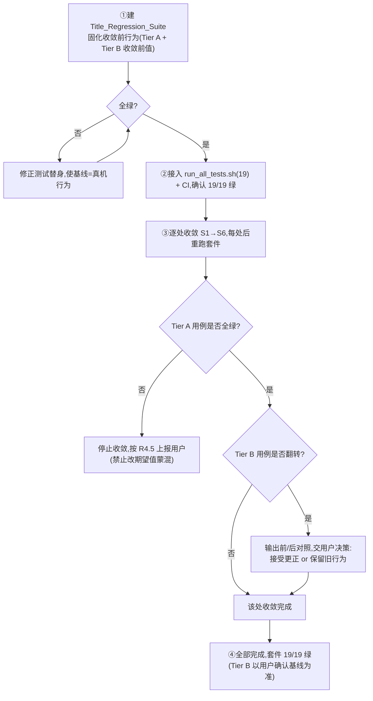

# Design Document

## Overview

本设计为 `title-display-hardening` 规格的技术方案,目标是对聊天页标题显示子系统(`app/pages/chat/modules/title-controller.js`,742 行、6 个对外方法)做**根因性治理**,而非继续打补丁。

三个工程目标(与 requirements 对齐):

1. **基线固化**:为 Title_Controller 的 6 个对外方法建立纯 Node 行为回归测试矩阵(单人/双人/多人 × A 端/B 端 × 真名/占位符),把历史上因"依赖太多 page 上下文"被降级跳过的那块测试补齐(R1、R2)。
2. **黑名单收敛**:把散落的占位符判定收敛到权威纯函数 `chat-helpers.isPlaceholderNickname()`(R3)。
3. **零行为变化保证**:先用测试固化现状再收敛,收敛后测试仍须全绿;测试本身作为 Behavior_Change 的判据(R4、R5)。

**核心设计取舍**:本治理的本质是"先给一段从未被测过、且充满时序耦合的 UI 决策代码织一张安全网,再在网下做最小重构"。因此设计的重心放在两件事上:

- **测试替身(fakePage)如何在纯 Node 环境里精确复刻 6 个方法所依赖的 page 上下文、`wx` API、`getCurrentPages()`、定时器**,使固化的基线等于真机运行时行为;
- **收敛带来的占位符识别范围变化是已知且有限的**(权威定义比散落数组更全),设计必须把每个"会翻转的判定点"显式列出,区分"修正根因 1 的预期收敛"与"需要保留的旧行为",交由用户拍板。

### 关键前置发现(影响 R3 范围,需用户确认)

在精确盘点 3 个文件后,发现 **inline 占位符判定点数量多于 requirements R3.5 所述的"5 处"**。requirements 把 title-controller 记为"3 处",但精确行号枚举显示 title-controller 内的散落判定有 4 个被点名位置(L461、L652、L663 三个数组 + L542 子串),再加 `join-by-invite.js` L156、`participant-listener.js` L501,被点名的精确位置共 **6 个行位置**;此外 title-controller 内还存在**未被点名的** inline 判定(L45、L128–130、L169–171、L256、L266)。

本设计采取的处理方式:以"用户点名的 6 个行位置"为**收敛执行范围**,将计数口径差异与额外未点名判定点**显式列入下文《占位符判定点完整盘点》表**,并按 R2.3 / R3.8 的升级机制交由用户在评审阶段确认范围。

## Architecture

### 系统上下文



### 设计原则

- **决策逻辑零改动**:不修改 6 个方法的分支结构、参与者人数阈值(`updateDynamicTitle` 的 `>3`、`updateDynamicTitleWithRealNames` 的 `>2`)、`protectReceiverTitle` 的轮询兜底(R4.1、R4.6)。
- **测试先行**:Title_Regression_Suite 先固化当前行为并全绿,再做收敛(R4.3)。
- **替身精确性优先**:fakePage 必须复刻真机运行时实际生效的依赖(尤其 `this.isPlaceholderNickname` 在真机上由 `chat.js` 绑定为权威实现),否则固化的基线会与真机背离。
- **变化点显式化**:收敛引起的识别范围变化逐点列出,绝不静默吞掉(R3.8)。
- **纯 Node、零新依赖**:沿用项目既有 `assert`/`assertEqual` + fakePage + `attach` 模式,不引入测试框架与 PBT 库(R1.2、R5.5)。

## Components and Interfaces

### 组件 1:Title_Regression_Suite(`.tools/title_controller_test.js`)

新增的回归测试文件,结构对齐 `system_message_test.js` / `burn_after_read_test.js`:

- 顶部:fake `setInterval`/`setTimeout`/`clearInterval`/`clearTimeout`(加载模块前替换)、`wx` 全局替身、`getApp` 替身。
- `makeTitlePage(overrides)`:fakePage 工厂,`attach` title-controller 6 个方法 + 绑定协作方法替身。
- 分组用例:按 6 个方法 + 决策矩阵组织,逐用例 `PASS/FAIL` 打印,末尾输出 `N pass / M fail` 并以 `process.exit(fail>0?1:0)` 退出(R5.5)。

### 组件 2:fakePage 上下文替身

这是设计的核心难点。下表列出 6 个方法依赖的全部 page 上下文,以及替身策略:

| 依赖 | 类型 | 被哪些方法读/调 | 替身策略 |
|---|---|---|---|
| `this.data.participants` | 输入数据 | 全部决策方法 | 由用例直接构造 `[{openId,nickName,isSelf}...]` |
| `this.data.currentUser` | 输入数据 | 全部 | 构造 `{openId:'self', nickName:'我自己'}` |
| `this.data.isFromInvite` | 身份标记 | 全部 | 用例设置(A 端 false / B 端 true) |
| `this.data.hasJoinedAsReceiver` | 身份标记 | `updateDynamicTitle` B 端保护分支 | 用例设置 |
| `this.data.dynamicTitle` | 前置标题 | `updateDynamicTitle`(双人保持/B 端保护) | 用例设置 |
| `this.receiverTitleLocked` | 实例属性 | `updateDynamicTitleWithRealNames` 锁定转交 | 用例设置 |
| `this.isReceiverEnvironment()` | 协作方法 | `updateDynamicTitle*` | 替身:返回 `!!this.data.isFromInvite`(与 `identity-utils` 主路径一致) |
| `this.isPlaceholderNickname(name)` | 协作方法 | `updateDynamicTitleWithRealNames` L460、兜底名计算 | **替身绑定为真权威实现** `ChatHelpers.isPlaceholderNickname`(复刻真机) |
| `this.deduplicateParticipants()` | 协作方法 | 去重分支 | spy:记录调用次数,不实际去重 |
| `this.fetchChatParticipants()` | 协作方法 | `updateDynamicTitle` 双人未找到对方 | spy(配合 fake timer) |
| `this.fetchChatParticipantsWithRealNames(flag)` | 协作方法 | `updateDynamicTitleWithRealNames` 占位符分支 | spy:记录调用与入参 |
| `this.retryGetRealInviterName()` | 协作方法 | `updateTitleForReceiver` 兜底重试 | spy(配合 fake timer) |
| `this.protectReceiverTitle(title)` | 协作方法 | `updateTitleForReceiver` 末尾 | 既是被测方法,也被 `updateTitleForReceiver` 调用;用例可注入 spy 版或调真实版 |
| `this.updateReceiverTitleWithRealNames()` | 协作方法 | 锁定转交 | spy(验证转交)或调真实版(验证产出) |
| `wx.setNavigationBarTitle({title})` | 微信 API | 全部 | 替身:记录最后一次 `title`(导航栏 Title_Decision) |
| `wx.cloud.callFunction({name,data,success,fail})` | 微信云 API | `fetchRealInviterNameAndUpdateTitle` | 替身:按用例同步回调 `success(res)` 或 `fail(err)` |
| `wx.getStorageSync('openId'/'inviteInfo')` | 微信存储 | 兜底名/openId 计算 | 替身:由用例提供返回值 |
| `getApp().globalData.userInfo/openId` | 全局 | openId 计算 | `getApp` 替身,由用例提供 |
| `getCurrentPages()[last].options` | 页面栈 | URL `inviter` 参数读取 | 替身:返回 `[{options:{inviter:...}}]` |
| `setData(patch, cb)` | 渲染 | 全部 | 替身:写入 `data` + 记录调用 + 同步执行 `cb` |

**fakePage 工厂接口**:

```javascript
/**
 * 构造一个挂载了 title-controller 全部方法的测试替身 page
 * @param {Object} overrides - 覆盖 data / 实例属性 / 协作方法替身 / 全局上下文
 * @returns {Object} fakePage(含 _navTitleCalls / _setDataCalls / _spies 记录)
 */
function makeTitlePage(overrides) { /* ... */ }
```

工厂内部维护的记录器(供断言读取):

- `page._setDataCalls`:每次 `setData` 的 patch 数组。
- `page._navTitleCalls`:`wx.setNavigationBarTitle` 收到的 title 序列(末项即最终导航栏标题)。
- `page._spies`:`{ deduplicateParticipants, fetchChatParticipants, fetchChatParticipantsWithRealNames, retryGetRealInviterName, updateReceiverTitleWithRealNames }` 的调用计数与入参。

### 组件 3:fake timers(复用 `burn_after_read_test.js` 模式)

`updateTitleForReceiver`(2s 后 `retryGetRealInviterName`)与 `protectReceiverTitle`(1s 轮询 + 30s 停止)会注册真实定时器。测试在加载模块前替换 `setInterval`/`setTimeout`,提供:

- `runAllTimeouts()`:按 delay 升序跑完所有未清 timeout(支持嵌套注册)。
- `tickAllIntervals()`:模拟一次 interval tick(用于验证 `protectReceiverTitle` 的恢复逻辑)。
- `resetTimers()`:每个用例前清空注册表,避免串扰。

这样既能验证"2s 后触发重试"(R 中 `updateTitleForReceiver` 兜底)、"interval 检测到错误标题后恢复"(R1.12),又不会让真实定时器在测试进程里悬挂。

### 组件 4:收敛后的生产代码接口(不新增对外接口)

收敛**不改变**任何对外签名,仅把 inline 判定替换为对权威纯函数的调用:

- title-controller.js / join-by-invite.js / participant-listener.js 顶部已 `require('./chat-helpers.js')`(title-controller 已 `const ChatHelpers = require('./chat-helpers.js')`),收敛后直接用 `ChatHelpers.isPlaceholderNickname(name)`,不再依赖 `this.isPlaceholderNickname` 的 `typeof ... === 'function'` 防御分支与 inline 数组兜底。

## Data Models

### 决策用例记录(测试内部数据结构)

```javascript
/**
 * 单个矩阵用例的输入/期望描述(用于驱动表驱动断言)
 * @typedef {Object} TitleCase
 * @property {string}  name              用例名(打印用)
 * @property {Object}  data              fakePage.data 初值
 * @property {Object}  [instance]        实例属性(receiverTitleLocked 等)
 * @property {Object}  [globals]         { storage, app, pages } 上下文
 * @property {string}  method            被测方法名
 * @property {*}        [arg]            方法入参(如 updateTitleForReceiver 的 inviterNickName)
 * @property {string}  [expectTitle]     期望最终 dynamicTitle(Title_Decision)
 * @property {Object}  [expectSpies]     期望协作方法调用(如 {deduplicateParticipants:1})
 * @property {string}  tier              'A'(行为不变,收敛前后均绿) | 'B'(收敛边界,可能翻转)
 */
```

### 输入维度枚举(Title_Decision_Matrix 的输入空间)

| 维度 | 取值 |
|---|---|
| 参与者人数 | 单人(≤1)、双人(2)、多人(3,未超阈值)、超阈值(`updateDynamicTitle`:>3;`updateDynamicTitleWithRealNames`:>2) |
| 端身份 | A_Side(`isFromInvite=false`,无 URL inviter)、A_Side+invite 参数、B_Side(`isFromInvite=true`) |
| 对方昵称类型 | Real_Nickname(如「小明」)、Placeholder(两套定义都认的:「朋友」「用户」「好友」「邀请者」)、**边界占位符**(散落数组漏判、但权威判占位的:「新用户」「发送方」「a端用户」「用户_123」「user_5」) |
| 临时 ID | `other.id === 'temp_user'`(强制视为未就绪) |

## 标题决策矩阵(R1 / R2 期望落地)

下表把 requirements R1/R2 的抽象矩阵落成**具体测试用例 → 期望标题**。`currentUser={openId:'self', nickName:'我自己'}`;对方真名统一用「小明」,真名标题即「我和小明（2）」;兜底名在无 URL/无 storage 真名时为「朋友」。

### `updateDynamicTitle`(去重阈值 `>3`)

| # | 人数 | 端 | 对方昵称 | 前置 dynamicTitle / 特殊 | 期望 Title_Decision | Tier | 验证 |
|---|---|---|---|---|---|---|---|
| D1 | 单人 | A | — | '' | `我自己` | A | R1.3 |
| D2 | 单人 | A | — | 前置含「（2）」如「我和小明（2）」 | 保持「我和小明（2）」(早退) | A | 现状行为 |
| D3 | 单人 | B | — | URL inviter=「小红」 | `我和小红（2）` | A | R1.4 |
| D4 | 单人 | B | — | 无 URL / 无 storage | `我和朋友（2）` | A | R1.4 |
| D5 | 双人 | A | 小明(真名) | 无 URL inviter | `我和小明（2）` | A | R1.5 |
| D6 | 双人 | A | 朋友(占位) | — | `我自己` | A | R1.6 |
| D7 | 双人 | A | 小明 + `id='temp_user'` | — | `我自己` | A | 现状行为 |
| D8 | 双人 | B | 小明(真名) | — | `我和小明（2）` | A | R1.5 |
| D9 | 双人 | B | 用户(占位) | 无 URL/storage | `我和朋友（2）`(兜底) | A | R1.6、R2.5 |
| D10 | 双人 | A+invite参数 | 小明 | URL inviter=「小明」 | `我和小明（2）` | A | R1.5 |
| D11 | 多人(3) | A | — | — | `群聊（3）` | A | R1.7 |
| D12 | 超阈值(4) | 任意 | — | — | 不直接设标题;`deduplicateParticipants` 被调 1 次 | A | R1.8 |
| D13 | 双人 | B | 小明(真名) | `hasJoinedAsReceiver=true`,前置「我和小明（2）」 | 保持(早退保护真名) | A | R1 B 端保护 |
| **D14** | 双人 | A | **新用户**(边界) | — | **收敛前**`我和新用户（2）`;**收敛后**`我自己` | **B** | R3.8 翻转点 |
| **D15** | 双人 | B | **新用户**(边界) | 无 URL/storage | **收敛前**`我和新用户（2）`;**收敛后**`我和朋友（2）` | **B** | R3.8 翻转点 |
| **D16** | 双人 | B | 真名含占位子串「用户体验师」 | `hasJoinedAsReceiver=true`,前置「我和用户体验师（2）」 | **收敛前**不保护(子串命中「用户」→重算);**收敛后**保护(早退) | **B** | R3.6 子串风险 |

### `updateDynamicTitleWithRealNames`(去重阈值 `>2`,先查 `receiverTitleLocked`)

| # | 人数 | 端 | 对方昵称 | 特殊 | 期望 Title_Decision | Tier | 验证 |
|---|---|---|---|---|---|---|---|
| R1c | 任意 | B | — | `receiverTitleLocked=true` | 转交 `updateReceiverTitleWithRealNames`(spy 命中),不走后续 | A | R1.9 |
| R2c | 单人 | A | — | — | `我自己` | A | R1.3 |
| R3c | 单人 | B | — | 无 URL/storage | `我和朋友（2）` | A | R1.4 |
| R4c | 双人 | A | 小明(真名) | — | `我和小明（2）` | A | R1.5 |
| R5c | 双人 | A | 朋友(占位) | — | `fetchChatParticipantsWithRealNames(true)` 被调 + 兜底 `我和朋友（2）` | A | R1.6、R2.5 |
| R6c | 超阈值(3) | 任意 | — | — | `deduplicateParticipants` 被调 1 次,不设标题 | A | R1.8、R1.8.1 |
| **R7c** | 双人 | A | **发送方**(边界) | — | **收敛前**`我和发送方（2）`(L461 兜底数组漏判,但真机 `this.isPlaceholderNickname` 已判占位→实际触发兜底);**收敛后**一致 | **B** | R3.8 见下文说明 |

> 说明:R7c 是验证"替身精确性"的关键用例 —— L461 是 `typeof this.isPlaceholderNickname === 'function' ? this.isPlaceholderNickname(...) : [inline 数组]` 形式。真机上 `this.isPlaceholderNickname` 恒被绑定,故走权威分支,inline 数组是死兜底。fakePage **必须**绑定权威实现,使固化基线 = 真机行为;此时该位置收敛(删兜底数组)对决策**零影响**(Tier 实际退化为 A)。这一点设计中标注以提醒:并非所有"看起来是黑名单"的位置收敛后都会翻转。

### `updateTitleForReceiver(inviterNickName)`(仅 B 端)

| # | 端 | 入参 / URL | 期望 | Tier | 验证 |
|---|---|---|---|---|---|
| T1 | A(`isFromInvite=false`) | 任意 | 直接 return,不设标题、不锁定 | A | 方法守卫 |
| T2 | B | 入参=「小明」 | `receiverTitleLocked=true`;标题`我和小明（2）`;`protectReceiverTitle` 被调 | A | R1 |
| T3 | B | URL inviter=encodeURIComponent(「张三」) | 双重解码后 `我和张三（2）` | A | R1.10 |
| T4 | B | 入参/URL/参与者全占位 | 兜底 `我和a端用户（2）`;2s 后 `retryGetRealInviterName` 被调(`runAllTimeouts`) | A | 兜底重试 |

### `updateReceiverTitleWithRealNames()`(B 端真名替换)

| # | 参与者 | 对方昵称 | 期望 | Tier | 验证 |
|---|---|---|---|---|---|
| RR1 | 空 | — | return,标题不变 | A | 现状 |
| RR2 | 2 人 | 小明(真名) | `我和小明（2）` | A | R1.5 |
| RR3 | 2 人 | 用户/朋友/好友(占位) | 保持当前标题(不更新) | A | R2.5 |
| RR4 | 3 人(去重后仍非 2) | 含真名邀请者 | 去重并强制更新为真名标题 | A | R1.8 去重路径 |

### `fetchRealInviterNameAndUpdateTitle()`(云函数取真名)

| # | 云函数返回 | 期望 | Tier | 验证 |
|---|---|---|---|---|
| F1 | `participants` 含对方 Real_Nickname「小明」 | `我和小明（2）`,`setNavigationBarTitle` 收到该标题 | A | R1.11 |
| F2 | 对方昵称为占位(命中 L45 数组) | 不更新标题 | A | 现状行为 |
| F3 | `fail` 回调 | 不更新标题,不抛出 | A | 错误处理 |

### `protectReceiverTitle(correctTitle)`(轮询保护)

| # | 场景(注入 dynamicTitle 后 `tickAllIntervals`) | 期望 | Tier | 验证 |
|---|---|---|---|---|
| P1 | 标题被改成「我自己」(不含「我和」「（2）」) | 恢复为 `correctTitle` | A | R1.12 |
| P2 | 标题仍为合法「我和X（2）」 | 不动 | A | R1.12 |
| P3 | 30s 后(`runAllTimeouts`) | `clearInterval` 被调,轮询停止 | A | R4.6 不改轮询机制 |

> **R2.3 / R2.5 差异登记**:D14、D15、D16 是当前实现"占位符泄漏进标题"或"子串误判"的偏离点。按 Authoritative_Title_Rules(占位符不进标题),收敛后的行为更正确;但因 R4 要求零行为变化,这些 Tier B 用例先按**收敛前实际产出**固化,收敛后若翻转则按 R4.5 上报用户决定基线归属。

## 占位符判定点完整盘点与收敛方案(R3)

### 完整盘点表

| 编号 | 文件:行 | 现状形式 | 是否用户点名 | 收敛动作 |
|---|---|---|---|---|
| S1 | title-controller.js:461 | `typeof this.isPlaceholderNickname==='function' ? this.isPlaceholderNickname(x) : ['用户','朋友','好友','邀请者','新用户'].includes(x)` | ✅ | 删三元兜底,直接 `ChatHelpers.isPlaceholderNickname(x)` |
| S2 | title-controller.js:652 | `!['用户','朋友','好友','邀请者'].includes(otherNameRaw)`(isDefinitelyASide,**漏「新用户」**) | ✅ | 改 `!ChatHelpers.isPlaceholderNickname(otherNameRaw)` |
| S3 | title-controller.js:663 | `!otherNameRaw || ['用户','朋友','好友','邀请者'].includes(otherNameRaw)`(**漏「新用户」**) | ✅ | 改 `ChatHelpers.isPlaceholderNickname(otherNameRaw)` |
| S4 | title-controller.js:539–545 | 对**已组合标题**`currentTitle.includes('用户'\|'朋友'\|'好友'\|'邀请者'\|'新用户')` 子串判断 | ✅ | **先提取对方昵称再判定**(见下文 R3.6 专项) |
| S5 | join-by-invite.js:156 | `!['朋友','邀请者','用户','好友','新用户'].includes(decodedInviterName)` | ✅ | 改 `!ChatHelpers.isPlaceholderNickname(decodedInviterName)` |
| S6 | participant-listener.js:501 | 逐项 `===` 比较 `'用户'\|'好友'\|'邀请者'\|'朋友'\|'新用户'` | ✅ | 改 `ChatHelpers.isPlaceholderNickname(otherP.nickName)` |
| — | title-controller.js:45 | `!['朋友','邀请者','用户','好友'].includes(...)`(`fetchRealInviterNameAndUpdateTitle`) | ❌ 未点名 | **flag 用户**:是否纳入(漏「新用户」「发送方」等) |
| — | title-controller.js:128–130 / 169–171 | `!== '用户' && !== '朋友' && !== '好友'`(`updateReceiverTitleWithRealNames`,仅 3 项) | ❌ 未点名 | **flag 用户** |
| — | title-controller.js:256 / 266 | `!== '朋友' && !== '好友' && !== '邀请者' && !== '用户'`(`updateTitleForReceiver` URL/兜底) | ❌ 未点名 | **flag 用户** |
| — | join-by-invite.js:140 区 | `!== '朋友' && !== '邀请者'`(立即标题,仅 2 项) | ❌ 未点名 | **flag 用户** |

> **范围结论**:本设计执行 S1–S6 共 6 个被点名行位置的收敛(对应 requirements 口径"5 处",计数差异已在 Overview 登记)。未点名的 4 组 inline 判定按 R2.3 升级机制交用户确认是否纳入。**建议**:为彻底消除根因 1(同一昵称跨路径判定不一致),应一并纳入;但因 R4 零行为变化约束,纳入后须为它们各自补固化用例并评估翻转点,故是否纳入由用户决定。

### R3.6 专项:S4 子串判断的"提取昵称再判定"方案

S4 当前是对**整段组合标题**(如「我和用户（2）」)做 `includes` 子串判断,语义与面向单一昵称的 `isPlaceholderNickname` 不同。收敛方案:

```javascript
// 收敛前(S4,title-controller.js:539-545)
const hasPlaceholder = currentTitle && (
  currentTitle.includes('用户') || currentTitle.includes('朋友') ||
  currentTitle.includes('好友') || currentTitle.includes('邀请者') ||
  currentTitle.includes('新用户')
);

// 收敛后:先提取对方昵称,再用权威检测器判定
function extractOtherNameFromTitle(title) {
  // 仅匹配"我和{X}（2）"格式;非此格式返回 null(交由外层按非占位处理)
  const m = /^我和(.+)（2）$/.exec(title || '');
  return m ? m[1] : null;
}
const otherName = extractOtherNameFromTitle(currentTitle);
const hasPlaceholder = otherName !== null && ChatHelpers.isPlaceholderNickname(otherName);
```

### 风险点专项(用户关注点 6):S4 收敛会否改变 `protectReceiverTitle` 的保护触发条件

**澄清边界**:S4 位于 `updateDynamicTitle` 的 **B 端早退保护分支**(L535–550),决定的是"`updateDynamicTitle` 是否早退、放过当前 B 端真名标题";它与 `protectReceiverTitle`(L300 区,独立的 1s 轮询)是**两套不同的保护**。`protectReceiverTitle` 自身的检测是**纯格式检查**(`includes('我和')` + `includes('（2）')` + `=== currentUser.nickName`),**不属于** Divergent_Blacklist 的 6 个收敛位置,本规格**不收敛、不触碰**(R4.6)。

**S4 收敛的真实风险**(两个方向的语义偏移):

1. **真名含占位子串被"解放保护"**:如「用户体验师」「好友记」——子串判断会命中`includes('用户')`/`includes('好友')`→`hasPlaceholder=true`→**不保护**(放行重算,可能覆盖真名);提取后 `isPlaceholderNickname('用户体验师')=false`→`hasPlaceholder=false`→**保护**(早退)。收敛后此类真名**被正确保护**——属预期更正(D16)。
2. **边界占位符被"收紧保护"**:如「发送方」——子串 5 词不含「发送方」→`hasPlaceholder=false`→**误保护**占位标题;提取后 `isPlaceholderNickname('发送方')=true`→`hasPlaceholder=true`→**不保护**(允许更新为真名)。收敛后占位标题**不再被误锁**——属预期更正。

**规避机制**(三重):

- **保护边界**:S4 仅在 `isFromInvite && hasJoinedAsReceiver` 且前置标题已是「我和…（2）」时才生效,blast radius 被严格限定在 B 端已加入态;非此前置不受影响。
- **固化先行**:D16 等用例先固化**收敛前**的早退/重算结果作为基线;收敛后若 D16 翻转 → 测试变红 → 按 R4.5 停止并上报用户,而非静默放过。
- **`protectReceiverTitle` 不动 + P1/P2/P3 守护**:用 P1–P3 固化 `protectReceiverTitle` 的纯格式检查行为,证明收敛 S4 未连带改动轮询保护(收敛前后 P1–P3 恒绿)。

## 收敛带来的识别范围变化点清单(R3.8)

权威 `isPlaceholderNickname` 比散落数组更全:除空值/空白外,黑名单含 `['用户','新用户','朋友','好友','邀请者','发送方','a端用户','A端用户','a端发送方','A端发送方']`,且匹配 `^用户[_\-\dA-Za-z]+$`、`^user[_\-\dA-Za-z]*$/i` 模式。

下表列出收敛后**从"非占位符"翻转为"占位符"**的昵称类别,及其对标题矩阵的影响:

| 昵称类别 | S1 (L461) | S2 (L652 A端) | S3 (L663 B端/A+invite) | S5 (join) | S6 (participant) | 翻转后标题影响 |
|---|---|---|---|---|---|---|
| `新用户` | 数组已含,无翻转(但真机走权威分支) | **翻转**:漏判→判占位 | **翻转**:漏判→判占位 | 数组已含 | 数组已含 | D14(A→`我自己`)、D15(B→兜底) |
| `发送方` | 真机已走权威,无翻转 | **翻转** | **翻转** | **翻转** | **翻转** | A 端→`我自己`;B 端→兜底 |
| `a端用户`/`A端用户`/`a端发送方`/`A端发送方` | 同上 | **翻转** | **翻转** | **翻转** | **翻转** | 同上(占位不再泄漏) |
| `用户_123` / `user_5`(模式) | 真机已走权威,无翻转 | **翻转** | **翻转** | **翻转** | **翻转** | 同上 |
| 真名含占位子串(仅 S4) | — | — | — | — | — | 仅 S4:此类**被正确保护**(D16) |

**结论与建议**(交用户确认):

- 上述翻转**全部方向一致**——让占位符**不再泄漏进标题**,与 Authoritative_Title_Rules 一致,属"**修正根因 1 的预期收敛**"。
- 按 R3.8 / R4.5,设计**不擅自决定**这些 Tier B 用例的最终基线:Title_Regression_Suite 先固化收敛前产出;收敛后翻转的用例由用户在评审中确认"接受更正(更新基线为新值)"还是"保留旧行为(回退该处收敛)"。
- S1 / R7c 提示:**并非所有点名位置收敛后都会翻转**——凡真机上已恒走 `this.isPlaceholderNickname` 权威分支的位置(S1),收敛仅是删除死代码兜底,决策零变化。

## Error Handling

| 场景 | 处理策略 |
|---|---|
| 云函数 `fetchRealInviterNameAndUpdateTitle` 失败 | 现状 `fail` 回调仅打日志、不改标题;测试 F3 固化"失败不抛、不改标题" |
| URL `decodeURIComponent` 抛异常 | 现状 `try/catch` 静默吞;测试用畸形编码(如孤立 `%`)固化"解码失败回退原值" |
| `getCurrentPages()` 返回空/无 options | 现状 `pages.length>0 ? ... : {}` 防御;fakePage 替身覆盖空栈用例 |
| fake timer 嵌套注册(2s 重试内再注册) | `runAllTimeouts` 循环直到无新增,避免漏跑 |
| `setData` 回调 `cb` 为空 | 替身 `if (cb) cb()` 防御,与生产 `setData` 语义一致 |
| 测试用例间 page/timer 串扰 | 每用例新建 `makeTitlePage` + `resetTimers()`,状态隔离 |
| 收敛后某 Tier A 用例变红 | 视为**真实回归信号**:停止收敛、按 R4.5 上报用户,严禁改测试期望值使其通过 |

## Testing Strategy

### 为什么不引入属性化测试(PBT)库

按工作流要求评估了 PBT 适用性,结论为**本特性不适合引入 PBT 库**,理由:

1. **被测对象是 UI 标题决策逻辑,输入空间是有限可枚举的矩阵**:Title_Decision 由「人数态 × 端身份 × 占位/真名」决定,对给定单元格,标题与具体真名内容无关(真名一律 `我和X（2）`)。真正有意义的输入变化(占位 vs 真名的分类)由 `isPlaceholderNickname` 承担,而该纯函数**已在 `chat_helpers_test.js` 中被独立测试**。
2. **收敛的识别范围差异是已知且有限的边界集**(「新用户」「发送方」「a端用户」系列 + `用户_xxx`/`user_xxx` 模式)。随机生成极难稳定命中这些边界,反而需要把边界编码进生成器——此时**精心挑选的边界语料 + 表驱动枚举比随机 PBT 更精准**。
3. **项目约定与零依赖约束**:现有 18 个测试全部是纯 Node `assert`/`assertEqual` + fakePage 模式,无任何测试框架/PBT 库;requirements R1.2、R5.5 明确要求沿用既有模式、PASS/FAIL 逐用例打印。引入 fast-check 与"零新依赖、纯 Node"约束冲突。

因此**省略 Correctness Properties 章节**,改以"表驱动的示例测试 + 边界语料不变量断言"覆盖,既满足 R2.4(显式枚举全部有效组合),又贴合项目约定。

### 测试层次

**1. 示例/矩阵回归测试(Title_Regression_Suite 主体)**

- 按上文《标题决策矩阵》逐单元格实现断言;每个 `TitleCase` 一条 `assertEqual(name, page.data.dynamicTitle, expectTitle)`,协作方法用例断言 spy 计数。
- 覆盖 6 个对外方法(R1.1)。
- 无法在纯 Node 完整复现的外部异步链,在测试文件注释中记录"部分覆盖/跳过范围与原因"(R1.13)——例如 `fetchChatParticipantsWithRealNames` 内部的云链不复现,仅断言其"被以正确入参调用"。

**2. 不变量断言(以参数化循环实现,非随机 PBT)**

对**精选昵称语料**做"for each"循环断言,落实 R2.5 与 R4 的等价性:

- **占位符不泄漏不变量(R2.5)**:对语料中每个 Placeholder_Nickname(含边界集),断言双人态产出的 Title_Decision 中不出现该占位符原文(被兜底替换或触发真名获取)。
- **收敛等价性不变量(R4 核心判据)**:对语料中每个**两套定义都认同**的输入(明确真名 + 明确占位「朋友」「用户」等),断言收敛前后 Title_Decision **完全一致**——这是 Tier A"零行为变化"的证据;对边界集输入,单列为 Tier B,产出供用户决策的"前/后对照表"而非强制相等。

```javascript
// 精选昵称语料(覆盖真名 / 共识占位 / 收敛边界 / 子串陷阱 / 模式)
const NICK_CORPUS = {
  real:        ['小明', '张三', 'Alice'],
  agreedPlace: ['朋友', '用户', '好友', '邀请者'],       // 两套都判占位 → Tier A 等价
  boundary:    ['新用户', '发送方', 'a端用户', 'A端用户'], // 散落漏判 → Tier B 翻转
  pattern:     ['用户_123', 'user_5'],                    // 仅权威模式命中 → Tier B
  substringTrap: ['用户体验师', '好友记'],                // 仅 S4 相关 → Tier B
};
```

**3. 集成接入(R5)**

- 在 `.tools/run_all_tests.sh` 新增第 19 个测试块(`node .tools/title_controller_test.js`),并把计数 `18 → 19`、末尾"全部 18 个"改为"全部 19 个"(R5.1、R5.2)。
- CI(`.github/workflows/ci.yml`)已运行 `run_all_tests.sh`,断言失败时 `process.exit(1)` 触发构建失败(R5.3);非断言失败(脚本/依赖/环境)按 R5.3.1 不强制归类。
- 输出格式与既有文件一致:逐用例 PASS/FAIL + 汇总(R5.4、R5.5)。

### 工作顺序与零行为变化保证机制(R4.3)



保证机制要点:

- **测试即判据(R4.1、R4.5)**:Title_Regression_Suite 是 Behavior_Change 的唯一裁决者。Tier A 全绿 = 受测矩阵内无行为变化;Tier B 翻转 = 显式上报,绝不私自改期望值使其通过。
- **决策分支与阈值零改动(R4.1)**:收敛只替换"判定昵称是否占位"的实现,不动人数阈值(`>3`/`>2`)、不动分支结构。
- **`protectReceiverTitle` 与身份时序零改动(R4.6)**:不在收敛范围,P1–P3 守护其行为不被连带影响。

## 设计决策与理由

| 决策 | 理由 |
|---|---|
| fakePage 把 `this.isPlaceholderNickname` 绑定为**真权威实现** | 真机上该方法恒由 `chat.js` 绑定为 `ChatHelpers.isPlaceholderNickname`;只有这样固化的基线才等于真机运行时行为,否则会错误地把 S1 标成会翻转 |
| 把矩阵分 Tier A / Tier B 两层 | A 层提供"零行为变化"的硬证据;B 层把已知有限的边界翻转显式隔离出来交用户决策,精准对应 R3.8 / R4.5 |
| S4 用正则提取昵称再判定,而非保留子串语义 | R3.6 明确要求语义对齐单一昵称检测;保留子串会让"真名含占位子串"持续误判,违背根因治理目标 |
| 不引入 PBT 库 | 输入空间有限可枚举、边界已知有限、项目零依赖约定;表驱动枚举 + 边界语料比随机 PBT 更精准且不破坏约定 |
| 未点名的 inline 判定仅 flag 不强收敛 | 尊重 requirements 的 5/6 处范围界定,按 R2.3 升级机制交用户,避免擅自扩大改动面引入未受控回归 |
| 收敛范围执行用户点名的 S1–S6 | 与 requirements R3.5 对齐(计数口径差异已登记),确保 5 处 Divergent_Blacklist 全部改调权威检测器(R3.7、R3.7.1) |

## 用户已确认的范围决策(评审定稿)

> 用户在设计评审阶段明确"按设计推荐的来",以下两项作为后续 tasks 的执行基准:

1. **收敛范围:全部收敛**。除被点名的 6 个行位置(S1–S6)外,title-controller 内 4 组未点名的 inline 占位符判定(L45 `fetchRealInviterNameAndUpdateTitle`、L128–130/L169–171 `updateReceiverTitleWithRealNames`、L256/L266 `updateTitleForReceiver`)以及 join-by-invite L140 区,一并收敛到 `ChatHelpers.isPlaceholderNickname()`。为每个未点名位置补固化用例并评估翻转点,确保不引入未受控回归。
2. **Tier B 翻转用例:接受更正**。收敛后,占位符昵称(「新用户」「发送方」「a端用户」系列、`用户_xxx`/`user_xxx` 模式、真名含占位子串等)不再泄漏进标题,与 Authoritative_Title_Rules 一致。Title_Regression_Suite 先固化收敛前产出,收敛后翻转的 Tier B 用例**将期望基线更新为收敛后的更正值**(并在测试注释中标注"收敛前→收敛后"对照),而非保留旧行为。Tier A 用例仍须严格零变化,变红即视为真实回归并停止上报。
