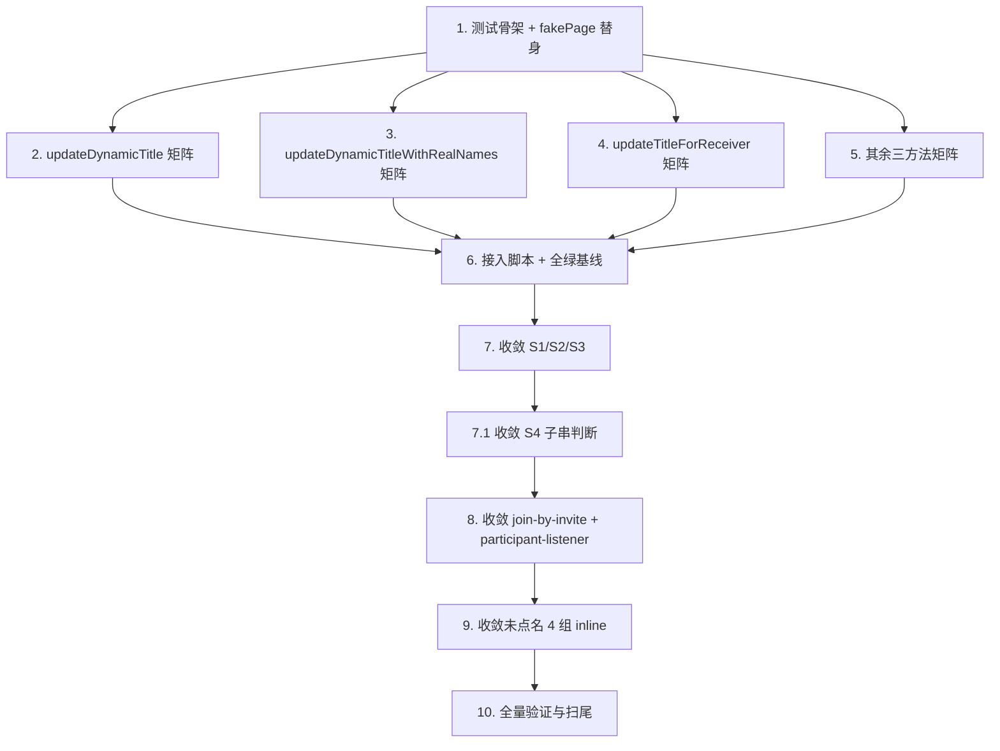

# Implementation Plan

## Overview

本计划对聊天页标题显示子系统(`title-controller.js`,6 个对外方法)做根因性治理:先用纯 Node 回归测试固化收敛前的标题决策行为基线,再把散落各处的占位符昵称黑名单收敛到权威纯函数 `chat-helpers.isPlaceholderNickname()`。全程以"业务行为零变化"为硬约束 —— Title_Regression_Suite 作为行为变化的唯一判据。

工作分三阶段:① 建测试套件固化基线并接入 CI;② 逐处收敛黑名单,每处后重跑;③ 全量验证与扫尾。

> 工作顺序硬约束(R4.3):先建测试固化收敛前基线 → 接入 run_all_tests.sh + CI → 再逐处收敛,每处后重跑全套。Tier A 用例变红即视为真实回归,停止并上报,严禁改期望值蒙混。
>
> 范围决策(用户已确认"按设计推荐的来"):全部收敛(6 处被点名 S1–S6 + 4 组未点名 inline 判定 + join-by-invite L140 区);Tier B 翻转用例接受更正(收敛后把期望基线更新为更正值并注释"收敛前→收敛后")。

## Task Dependency Graph



```json
{
  "waves": [
    { "wave": 1, "tasks": ["1"] },
    { "wave": 2, "tasks": ["2", "3", "4", "5"] },
    { "wave": 3, "tasks": ["6"] },
    { "wave": 4, "tasks": ["7"] },
    { "wave": 5, "tasks": ["7.1"] },
    { "wave": 6, "tasks": ["8"] },
    { "wave": 7, "tasks": ["9"] },
    { "wave": 8, "tasks": ["10"] }
  ]
}
```

## Tasks

### 阶段一:建立回归测试套件并固化收敛前基线

- [x] 1. 搭建 `title_controller_test.js` 测试骨架与 fakePage 上下文替身
  - 新建 `.tools/title_controller_test.js`,顶部按 burn_after_read_test.js 模式替换 fake setInterval/setTimeout/clearInterval/clearTimeout(加载模块前),提供 runAllTimeouts / tickAllIntervals / resetTimers
  - mock 全局 `wx`(setNavigationBarTitle 记录 title 序列、cloud.callFunction 可配置 success/fail、getStorageSync)、`getApp`、`getCurrentPages`
  - 实现 `makeTitlePage(overrides)` 工厂:attach title-controller 6 个方法,setData 替身(写入 data + 记录 _setDataCalls + 同步执行 cb),协作方法 spy(deduplicateParticipants / fetchChatParticipants / fetchChatParticipantsWithRealNames / retryGetRealInviterName / updateReceiverTitleWithRealNames),关键:`page.isPlaceholderNickname` 绑定为真权威实现 `ChatHelpers.isPlaceholderNickname`、`page.isReceiverEnvironment` 返回 `!!this.data.isFromInvite`
  - 实现 withSilence / assert / assertEqual,末尾输出 `N pass / M fail` 并 `process.exit(fail>0?1:0)`
  - _需求: R1.1, R1.2, R1.13_

- [x] 2. 固化 `updateDynamicTitle` 决策矩阵(去重阈值 >3)
  - 实现设计矩阵 D1–D16:单人 A/B、双人 A/B(真名/占位/temp_user)、多人(3)、超阈值(4 触发 deduplicateParticipants)、B 端真名保护早退
  - Tier A 用例(D1–D13)按当前实现实际产出固化;Tier B 用例(D14「新用户」、D15、D16 真名含占位子串)先固化收敛前产出,测试注释标注"收敛前值 / 收敛后预期值(待阶段三更新)"
  - _需求: R1.3, R1.4, R1.5, R1.6, R1.7, R1.8, R1.8.1, R2.4, R2.5_

- [x] 3. 固化 `updateDynamicTitleWithRealNames` 决策矩阵(去重阈值 >2 + receiverTitleLocked 转交)
  - 实现 R1c–R7c:receiverTitleLocked 转交 updateReceiverTitleWithRealNames(spy 命中)、单人 A/B、双人 A 真名、双人 A 占位(触发 fetchChatParticipantsWithRealNames(true) + 兜底)、超阈值(3)触发去重、边界占位符(R7c「发送方」验证替身精确性)
  - _需求: R1.3, R1.4, R1.5, R1.6, R1.9, R1.8, R2.5_

- [x] 4. 固化 `updateTitleForReceiver` 决策矩阵(仅 B 端 + URL 解码 + 兜底重试)
  - 实现 T1–T4:A 端守卫直接 return;B 端入参真名;URL inviter 双重解码;全占位兜底「a端用户」+ runAllTimeouts 后 retryGetRealInviterName 被调;验证 receiverTitleLocked 置真、protectReceiverTitle 被调
  - _需求: R1.10_

- [x] 5. 固化 `updateReceiverTitleWithRealNames` / `fetchRealInviterNameAndUpdateTitle` / `protectReceiverTitle`
  - updateReceiverTitleWithRealNames:RR1 空参与者 return、RR2 双人真名、RR3 占位保持、RR4 去重后强制真名
  - fetchRealInviterNameAndUpdateTitle:F1 云函数返回真名更新 + setNavigationBarTitle、F2 占位不更新、F3 fail 不抛
  - protectReceiverTitle:P1 错误标题被恢复(tickAllIntervals)、P2 合法标题不动、P3 30s 后 clearInterval(runAllTimeouts)
  - _需求: R1.11, R1.12, R4.6_

- [x] 6. 接入一键测试脚本并确认全绿基线
  - 在 `.tools/run_all_tests.sh` 新增第 19 个测试块 `node .tools/title_controller_test.js`,把计数 18→19、末尾"全部 18 个"→"全部 19 个"同步更新
  - 跑 `bash .tools/run_all_tests.sh`,确认 19/19 全绿,记录收敛前 PASS 总数作为基线
  - _需求: R4.3, R5.1, R5.2, R5.4, R5.5_

### 阶段二:逐处收敛占位符黑名单到权威检测器

- [x] 7. 收敛 title-controller.js 的 S1/S2/S3(三处数组)
  - S1(L461):删 `typeof this.isPlaceholderNickname === 'function' ? ... : [数组]` 三元兜底,直接 `ChatHelpers.isPlaceholderNickname(otherNameRaw)`
  - S2(L652)/S3(L663):`['用户','朋友','好友','邀请者']` 数组(漏「新用户」)改为 `ChatHelpers.isPlaceholderNickname(...)`
  - 改完重跑全套:Tier A 必须仍全绿;Tier B(D14/D15)若翻转,按用户确认更新期望基线为收敛后值并补"收敛前→收敛后"注释
  - _需求: R3.1, R3.2, R3.5, R3.8, R4.1, R4.2, R4.4, R4.5_

- [x] 7.1 收敛 title-controller.js 的 S4(组合标题子串判断 → 提取昵称再判定)
  - L539-545:实现 `extractOtherNameFromTitle(title)`(正则 `/^我和(.+)（2）$/` 提取,非此格式返回 null),改为 `const otherName = extractOtherNameFromTitle(currentTitle); const hasPlaceholder = otherName !== null && ChatHelpers.isPlaceholderNickname(otherName);`
  - 重跑全套,重点核对 D16(真名含占位子串如「用户体验师」收敛后被正确保护)按 Tier B 更正基线;确认 P1–P3 仍全绿(证明未连带改动 protectReceiverTitle)
  - _需求: R3.6, R4.5, R4.6_

- [x] 8. 收敛 join-by-invite.js(S5 + L140 区)与 participant-listener.js(S6)
  - join-by-invite L156(S5)`['朋友','邀请者','用户','好友','新用户']` 数组 + L140 区 inline 判定改 `ChatHelpers.isPlaceholderNickname(...)`(确认已 require chat-helpers)
  - participant-listener L501(S6)逐项 `===` 比较改 `this.isPlaceholderNickname(otherP.nickName)` 或 `ChatHelpers.isPlaceholderNickname(...)`
  - 重跑全套确认全绿(这两个模块已有 join-by-invite 一致性测试与 participant-listener 测试守护)
  - _需求: R3.3, R3.4, R3.5, R4.4_

- [x] 9. 收敛 title-controller.js 未点名的 4 组 inline 判定
  - L45(fetchRealInviterNameAndUpdateTitle)、L128-130/L169-171(updateReceiverTitleWithRealNames)、L256/L266(updateTitleForReceiver URL/兜底)全部改 `ChatHelpers.isPlaceholderNickname(...)`
  - 这几处原数组仅 3-4 项(漏「新用户」「发送方」等),收敛后识别范围扩大;为受影响的 RR2/RR3/T3/T4/F1/F2 评估翻转点,翻转的按 Tier B 更正基线
  - 重跑全套确认全绿
  - _需求: R3.1, R3.2, R3.7, R3.7.1, R3.8, R4.5_

### 阶段三:收敛收尾与全量验证

- [x] 10. 全量验证与扫尾
  - 全局搜索确认 title-controller / join-by-invite / participant-listener 中不再保留独立于 isPlaceholderNickname 的占位符判定数组或内联 === 比较(R3.7)
  - 跑 `bash .tools/run_all_tests.sh` 确认 19/19 全绿;统计收敛后 PASS 总数
  - 整理 Tier B 翻转用例的"收敛前→收敛后"对照清单(写入测试文件注释或 spec 备注),作为本次治理的行为更正记录
  - _需求: R3.7, R3.7.1, R4.4, R5.4_

## Notes

- **测试模式**:纯 Node + fakePage + attach,无测试框架/PBT 库依赖,逐用例 PASS/FAIL 打印,沿用 system_message_test.js / burn_after_read_test.js 既有风格。
- **关键替身**:fakePage 必须把 `isPlaceholderNickname` 绑定为真权威实现 `ChatHelpers.isPlaceholderNickname`(真机上 chat.js 恒这么绑),否则会错误判断哪些收敛点会翻转(S1/R7c 实际不翻转)。
- **Tier 分层**:Tier A = 收敛前后行为必须完全一致(零变化硬证据,变红即真实回归);Tier B = 已知有限的边界翻转点(占位符不再泄漏进标题),收敛后接受更正并更新期望基线。
- **不在范围**:不修改 6 个方法的决策分支结构与人数阈值(>3 / >2);不触碰 `protectReceiverTitle` 轮询机制本身、身份判定时序;无部署/真机验证任务(真机通道不通,纯静态测试守护)。
- **提交习惯**:每个任务一次独立 commit,中文 commit message;每处收敛后重跑 `bash .tools/run_all_tests.sh` 再提交。
- **CI**:`.github/workflows/ci.yml` 已运行 `run_all_tests.sh`,无需改 CI 配置;断言失败时 `process.exit(1)` 触发构建失败。

## 执行结果(完成)

- 测试套件:18 → 19 个,790 → 843 PASS(新增 title_controller_test.js 53 用例),CI 守护。
- 收敛范围:title-controller 12 处(6 命名 S1–S4 区 + 6 未命名)+ join-by-invite 2 处(S5 + L140 区)+ participant-listener S6,全部改调 `isPlaceholderNickname()`。3 个文件已无数组形式占位符黑名单。
- Tier B 行为更正(已确认接受):D14「新用户」A端 我和新用户（2）→我自己;D15「新用户」B端 →我和朋友（2）。D16/R7c 收敛前后产出一致。Tier A 49 用例零变化。
- **后续跟进项(本 spec 范围外)**:`participant-listener.js` `fetchChatParticipantsWithRealNames` 内 1 处 `nickName === '用户'` 单字面量检测,因不在确认范围且该方法无回归测试守护,按 R4 保留不动。如需彻底清零,应另起小 spec 先补该方法回归测试再收敛。
