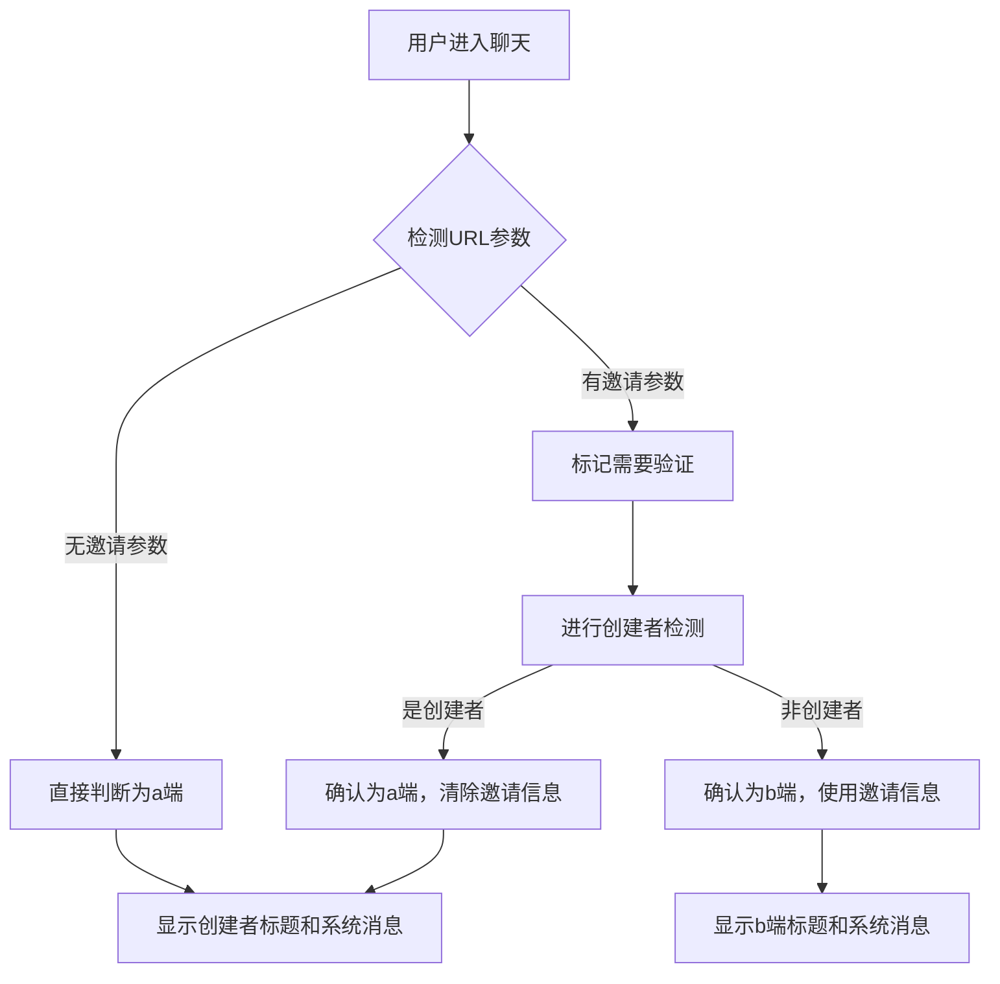

# 🚨 CRITICAL - a端身份误判紧急修复

## 🎯 问题描述

用户反馈a端用户（创建者）在没有分享链接的情况下，被错误识别为b端用户，导致：

1. **错误标题**：显示 `"我和Y.（2）"` 而不是自己的昵称
2. **错误系统消息**：显示 `"加入朋友的聊天"` 而不是 `"您创建了私密聊天"`

## 🔍 根本原因

### 问题分析

1. **优先检查逻辑过于激进**：
   ```javascript
   // 问题代码（修复前）
   if (hasExplicitInviterParam || hasJoinAction || hasFromInviteFlag) {
     console.log('🔥 [优先检查] 检测到明确的b端标识，跳过创建者检查');
     isFromInvite = true;
     skipCreatorCheck = true; // ❌ 直接跳过创建者检查
   }
   ```

2. **身份验证顺序错误**：
   - 仅基于URL参数存在就直接认定为b端
   - 跳过了创建者身份验证
   - 没有考虑用户可能重复进入自己创建的聊天

3. **日志证据**：
   ```
   🔥 [优先检查] options.inviter: %E6%9C%8B%E5%8F%8B
   🔥 [优先检查] 检测到明确的b端标识，跳过创建者检查
   🔥 [最终判断] - 最终结果: true  // ❌ 错误识别为b端
   ```

## 🔧 修复方案

### 1. 优先检查逻辑修复

**文件：** `app/pages/chat/chat.js` (Lines 167-178)

```javascript
// 🔥 【关键修复】有URL邀请参数时，先检查是否为创建者，再决定身份
let skipCreatorCheck = false;
let isFromInvite; // 🔥 声明变量
let preliminaryInviteDetected = hasExplicitInviterParam || hasJoinAction || hasFromInviteFlag;

if (preliminaryInviteDetected) {
  console.log('🔥 [优先检查] 检测到URL邀请参数，但需要先验证是否为创建者');
  // 🔥 不直接设置 isFromInvite，而是标记需要进一步验证
  console.log('🔥 [优先检查] 将进行创建者验证以确定真实身份');
}
```

### 2. 创建者检测后的身份设置

**文件：** `app/pages/chat/chat.js` (Lines 275-278)

```javascript
// 强制设为发送方模式
isFromInvite = false;
inviter = null;
skipCreatorCheck = true; // 🔥 确认为创建者，跳过后续b端检测
```

### 3. URL参数处理逻辑

**文件：** `app/pages/chat/chat.js` (Lines 304-315)

```javascript
// 🔥 【关键修复】如果之前未设置isFromInvite，根据URL参数和创建者状态决定
if (typeof isFromInvite === 'undefined') {
  // 如果URL有邀请参数但用户不是创建者，确认为b端
  if (preliminaryInviteDetected && !skipCreatorCheck) {
    console.log('🔥 [身份确认] URL有邀请参数且非创建者，确认为b端');
    isFromInvite = true;
    inviter = decodeURIComponent(decodeURIComponent(options.inviter || inviteInfo?.inviter || '邀请者'));
  } else {
    // 其他情况的默认判断
    isFromInvite = !!inviter || options.fromInvite === 'true' || options.fromInvite === true;
    console.log('🔥 [默认设置] isFromInvite设置为默认值:', isFromInvite);
  }
}
```

### 4. 最终身份判断修复

**文件：** `app/pages/chat/chat.js` (Lines 432-435)

```javascript
// 🔥 【URGENT-FIX】优先检查是否已确认为a端创建者
if (skipCreatorCheck && (this.needsCreatorMessage === false)) {
  // 已经确认为创建者，绝对是发送方
  finalIsFromInvite = false;
  console.log('🔥 [最终判断] 已确认为a端创建者，绝对是发送方');
}
```

### 5. 后续检测逻辑调整

**文件：** `app/pages/chat/chat.js` (Line 332)

```javascript
// 🔥 【URGENT-FIX】在已确认为a端创建者后，跳过所有b端检测逻辑
if (!isConfirmedCreator && !skipCreatorCheck) {
```

## 🧪 修复验证

### 测试场景

1. **a端用户登录（无分享链接）**：
   - **期望标题**：显示自己的昵称（如"向冬"）
   - **期望系统消息**：`"您创建了私密聊天，可点击右上角菜单分享链接邀请朋友加入"`

2. **a端用户重新进入自己的聊天**：
   - **期望标题**：显示自己的昵称
   - **期望系统消息**：保持创建者消息不变

3. **b端用户通过邀请链接加入**：
   - **期望标题**：`"我和XX（2）"`（XX为a端昵称）
   - **期望系统消息**：`"加入XX的聊天"`（XX为a端昵称）

### 关键日志标识

```javascript
// ✅ 修复成功的日志标识
'🔥 [身份判断修复] 检测到用户是聊天创建者，应为a端（发送方）'
'🔥 [身份判断修复] 已清除邀请信息，用户确认为a端'
'🔥 [最终判断] 已确认为a端创建者，绝对是发送方'
'🔥 [统一标题] 默认标题设置为用户昵称:'
'🔥 [a端系统消息] ✅ 已添加创建聊天提示:'
```

## 🎯 修复原理

### 身份验证新流程



### 关键改进

1. **渐进式验证**：不再因为有URL参数就直接跳过创建者检测
2. **优先级调整**：创建者身份验证优先于URL参数判断
3. **防误判机制**：确认为创建者后强制清除邀请信息
4. **一致性保证**：确保所有相关逻辑都基于正确的身份判断

## ✅ 成功标志

1. **a端用户正确识别**：显示自己昵称作为标题
2. **系统消息正确**：显示创建聊天的提示信息
3. **无误判情况**：即使URL有残留参数也能正确识别身份
4. **b端功能不受影响**：真正的b端用户仍然正常工作

## 🚨 注意事项

- 修复采用保守策略：优先保证创建者身份不被误判
- 保留了所有现有的b端检测逻辑，确保兼容性
- 增强了日志输出，便于后续问题排查
- 修复不影响现有的b端用户体验

这次修复解决了根本性的身份识别混乱问题，确保了聊天应用的基础功能正确性。