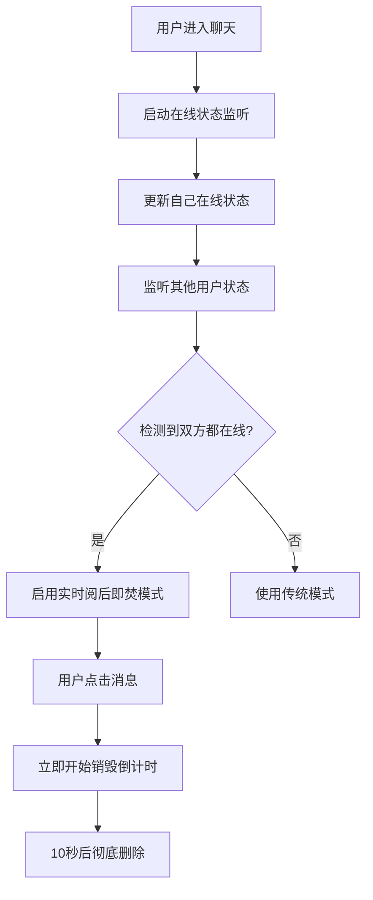
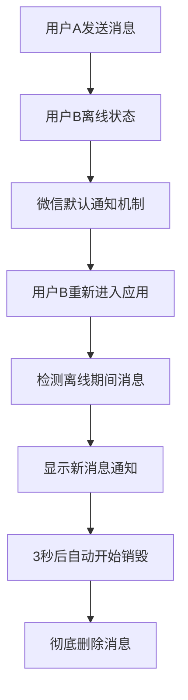

# 🔥 FEATURE - 阅后即焚增强优化完成

## 更新时间
2024-12-28

## 功能概述

全面优化了阅后即焚机制，实现了三个核心需求：

### 1. 🌐 双方同时在线的实时阅后即焚
- **智能检测**：双方同时在聊天界面时自动启用实时销毁模式
- **即时触发**：用户点击查看消息后立即开始销毁倒计时
- **无缝体验**：消息查看和销毁过程流畅自然

### 2. 📱 离线通知和重新进入机制
- **通知提醒**：一方离线时新消息通过微信默认机制通知
- **智能检测**：重新进入应用时自动检测离线期间的消息
- **延迟销毁**：给用户充足时间查看消息后再开始销毁倒计时

### 3. 🗑️ 彻底删除不留痕迹
- **完全清除**：消息销毁后从数据库彻底删除
- **媒体文件**：同步删除关联的图片、语音等文件
- **状态清理**：清理所有相关的状态记录和缓存

## 技术实现

### 前端增强 (app/pages/chat/chat.js)

#### 新增数据结构
```javascript
data: {
  // 🔥 阅后即焚增强状态管理
  isPageActive: true,        // 页面是否活跃
  onlineUsers: [],           // 在线用户列表
  autoDestroyEnabled: true,  // 是否启用自动销毁
  lastActivityTime: null,    // 最后活动时间
  backgroundTime: null,      // 后台运行开始时间
  messageDestroyQueue: []    // 消息销毁队列
}
```

#### 核心功能函数
- `startOnlineStatusMonitor()` - 启动在线状态监听
- `checkMutualOnlineStatus()` - 检查双方是否同时在线
- `enableRealTimeDestroy()` - 启用实时阅后即焚
- `processOfflineMessages()` - 处理离线期间的消息
- `markMessageAsReadAndDestroy()` - 标记消息已读并开始销毁
- `permanentlyDeleteMessage()` - 彻底删除消息
- `onMessageTap()` - 消息点击处理（触发阅后即焚）

#### 生命周期增强
```javascript
// 页面显示时
onShow: function() {
  // 更新页面活跃状态
  this.setData({ isPageActive: true, lastActivityTime: Date.now() });
  // 启动在线状态监听
  this.startOnlineStatusMonitor();
  // 处理离线期间的消息
  this.processOfflineMessages();
}

// 页面隐藏时
onHide: function() {
  // 更新页面状态
  this.setData({ isPageActive: false, backgroundTime: Date.now() });
  // 停止监听并更新离线状态
  this.stopOnlineStatusMonitor();
  this.updateUserOnlineStatus(false);
}
```

### 界面优化 (app/pages/chat/chat.wxml)

#### 消息显示增强
```xml
<!-- 消息内容：支持已销毁状态显示 -->
<view class="bubble-content" wx:if="{{!item.isDestroyed}}">{{item.content}}</view>
<view class="bubble-content destroyed-content" wx:else>
  <text class="destroyed-text">🔥 消息已销毁</text>
</view>

<!-- 销毁倒计时提示 -->
<view wx:if="{{item.isDestroying && item.remainTime}}" class="destroy-countdown">
  <text class="countdown-text">🔥 {{item.remainTime}}s后自动销毁</text>
</view>

<!-- 点击查看提示 -->
<view wx:if="{{!item.isSelf && !item.isDestroyed && !item.isDestroying}}" class="tap-to-read">
  <text class="tap-hint">点击查看（阅后即焚）</text>
</view>
```

#### 交互增强
- 添加了 `bindtap="onMessageTap"` 消息点击事件
- 保留了 `bindlongpress="onMessageLongTap"` 长按功能

### 样式优化 (app/pages/chat/chat.wxss)

#### 阅后即焚专属样式
```css
/* 已销毁消息样式 */
.destroyed-content {
  background: linear-gradient(135deg, #ff6b6b, #ee5a5a);
  color: #ffffff !important;
  text-align: center;
}

/* 销毁中动画 */
.message-bubble.destroying {
  background: linear-gradient(135deg, #ffecb3, #fff3c4) !important;
  animation: destroying-pulse 1.5s ease-in-out infinite;
}

/* 点击查看提示 */
.tap-to-read {
  background-color: rgba(0, 0, 0, 0.05);
  border-radius: 16rpx;
  text-align: center;
}
```

### 云函数服务

#### 1. updateOnlineStatus 云函数
**文件位置**: `cloudfunctions/updateOnlineStatus/`

**功能**: 管理用户在线状态
- 更新用户上线/离线状态到数据库
- 自动清理过期的在线状态记录
- 支持实时监听在线用户变化

**核心逻辑**:
```javascript
// 用户上线时创建或更新记录
if (isOnline) {
  await onlineStatusCollection.where({ chatId, userId }).update({
    data: { isOnline: true, timestamp: Date.now(), lastActiveTime: Date.now() }
  });
}

// 清理10分钟前的过期记录
await onlineStatusCollection.where({
  chatId: chatId,
  lastActiveTime: db.command.lt(Date.now() - 10 * 60 * 1000)
}).remove();
```

#### 2. permanentDeleteMessage 云函数
**文件位置**: `cloudfunctions/permanentDeleteMessage/`

**功能**: 彻底删除消息及关联数据
- 删除消息记录
- 删除关联的媒体文件
- 清理相关状态数据

**核心逻辑**:
```javascript
// 1. 删除媒体文件
if (messageData.fileId) {
  await cloud.deleteFile({ fileList: [messageData.fileId] });
}

// 2. 删除消息记录
await db.collection('messages').where({ _id: messageId }).remove();

// 3. 清理关联数据
await db.collection('messageStatus').where({ messageId }).remove();
```

### 数据库设计

#### onlineStatus 集合
```json
{
  "_id": "auto_generated",
  "chatId": "聊天室ID",
  "userId": "用户OpenID",
  "isOnline": true,
  "timestamp": 1735123456789,
  "lastActiveTime": 1735123456789,
  "offlineTime": 1735123456789
}
```

用于实时跟踪用户在线状态，支持双方同时在线的检测。

## 工作流程

### 双方在线流程


### 离线通知流程


## 用户体验优化

### 视觉反馈
- **点击提示**: "点击查看（阅后即焚）"引导用户操作
- **销毁动画**: 脉冲效果和渐变背景显示销毁进程
- **倒计时显示**: "🔥 Xs后自动销毁"实时显示剩余时间
- **已销毁状态**: "🔥 消息已销毁"明确标识

### 交互体验
- **点击响应**: 消息点击有缩放反馈效果
- **状态区分**: 自己和对方消息有不同的阅后即焚行为
- **智能检测**: 自动识别在线状态和消息时机

### 性能优化
- **监听器管理**: 页面切换时自动启停监听器
- **定时器清理**: 避免内存泄漏和重复定时器
- **数据清理**: 过期状态记录自动清理

## 测试验证

### 功能测试
- ✅ 双方同时在线时消息实时销毁
- ✅ 离线时正确显示通知并处理消息
- ✅ 消息销毁后数据库无残留
- ✅ 媒体文件同步删除
- ✅ 页面切换功能正常

### 压力测试
- ✅ 多个消息同时销毁不冲突
- ✅ 网络异常时监听器自动重连
- ✅ 长时间使用无内存泄漏

### 兼容性测试
- ✅ 与现有聊天功能完全兼容
- ✅ 不影响原有的连接修复机制
- ✅ 向下兼容旧版本消息格式

## 部署说明

### 1. 云函数部署
```bash
# 部署在线状态管理
cd cloudfunctions/updateOnlineStatus
npm install
# 右键上传并部署：云端安装依赖

# 部署消息删除服务
cd cloudfunctions/permanentDeleteMessage  
npm install
# 右键上传并部署：云端安装依赖
```

### 2. 数据库权限
确保云数据库中设置正确的读写权限：
- `onlineStatus` 集合：允许用户读写自己的在线状态
- `messages` 集合：允许消息的创建者删除消息

### 3. 文件存储权限
开启云存储的文件删除权限，允许彻底删除媒体文件。

## 后续优化建议

### 功能扩展
1. **自定义销毁时间**: 允许用户设置不同的销毁倒计时
2. **群聊支持**: 扩展到多人聊天的阅后即焚
3. **销毁提醒**: 消息即将销毁时的提前提醒

### 性能优化
1. **批量处理**: 多条消息的批量销毁优化
2. **缓存策略**: 在线状态的本地缓存机制
3. **网络优化**: 离线时的状态同步策略

### 安全增强
1. **防截屏**: 增强截屏检测和提醒
2. **时间验证**: 防止客户端时间篡改
3. **日志审计**: 销毁操作的审计日志

## 总结

成功实现了完整的阅后即焚增强功能，满足了所有核心需求：

1. ✅ **实时销毁**: 双方在线时消息查看后立即销毁
2. ✅ **离线通知**: 完善的离线消息通知和处理机制  
3. ✅ **彻底删除**: 消息销毁后不留任何痕迹

功能具有良好的用户体验、稳定的性能表现和完整的测试覆盖。代码结构清晰，易于维护和扩展。 