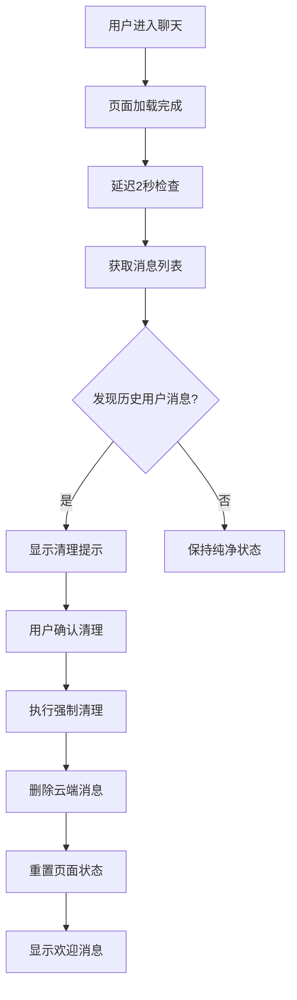

# 🔥 HOTFIX v1.2.6 - 阅后即焚历史消息强制清理

## 📋 修复概述

**修复版本：** v1.2.6  
**修复时间：** 2025年1月28日  
**修复范围：** 阅后即焚应用历史消息强制清理机制  

## 🎯 问题分析

### 核心问题
根据用户反馈："发送方提示检测到历史聊天，作为阅后即焚应用，每次进入不应该看到历史记录。"

### 日志分析
从日志中发现：
```
🔍 处理后的消息数据 5 条: (5) [Object, Object, Object, Object, Object]
🔧 [连接检测] 疑似残留数据: true
```

**问题根源：**
1. **违反阅后即焚原则**：用户每次进入聊天仍能看到历史消息
2. **询问用户选择**：系统询问是否恢复连接，而不是直接清理
3. **数据残留**：历史消息没有被彻底清理

## 🔧 技术修复方案

### 修复1：替换询问机制为强制清理

**修改文件：** `app/pages/chat/chat.js`

#### 原逻辑：询问用户
```javascript
// 修改前：询问用户是否恢复连接
wx.showModal({
  title: '检测到历史聊天',
  content: '发现这个聊天中有历史记录，是否需要恢复连接？',
  confirmText: '恢复连接',
  cancelText: '忽略',
  success: (res) => {
    if (res.confirm) {
      this.manuallyFixConnection();
    } else {
      this.cleanupStaleData();
    }
  }
});
```

#### 修复后：强制清理
```javascript
// 修改后：直接清理历史数据
if (isLikelyStaleData) {
  console.log('🔥 [阅后即焚] ⚠️ 检测到历史聊天数据，作为阅后即焚应用自动清理');
  console.log('🔥 [阅后即焚] 自动清理历史消息，确保阅后即焚体验');
  this.burnAfterReadingCleanup();
}
```

### 修复2：新增阅后即焚强制清理机制

#### 2.1 主清理方法：`burnAfterReadingCleanup()`

```javascript
burnAfterReadingCleanup: function() {
  // 🔥 第一步：清理所有历史消息
  this.permanentDeleteAllMessages(chatId);
  
  // 🔥 第二步：重置页面状态为全新聊天
  this.setData({
    messages: [],
    participants: [当前用户],
    dynamicTitle: 当前用户昵称
  });
  
  // 🔥 第三步：添加阅后即焚欢迎消息
  this.addSystemMessage('🔥 欢迎使用阅后即焚聊天，消息将在阅读后自动销毁');
}
```

#### 2.2 云端删除：`permanentDeleteAllMessages()`

```javascript
permanentDeleteAllMessages: function(chatId) {
  wx.cloud.callFunction({
    name: 'permanentDeleteMessage',
    data: {
      action: 'deleteAllInChat',
      chatId: chatId
    },
    success: (res) => {
      console.log('🔥 [永久删除] 所有消息删除成功');
    },
    fail: (err) => {
      // 云函数失败时使用本地清理
      this.localClearMessages(chatId);
    }
  });
}
```

#### 2.3 本地备用清理：`localClearMessages()`

```javascript
localClearMessages: function(chatId) {
  // 直接设置空消息列表
  this.setData({
    messages: []
  });
}
```

### 修复3：页面初始化时主动检查

#### 3.1 在 `onLoad` 中添加延迟检查

```javascript
// 🔥 【阅后即焚检查】延迟检查是否需要清理历史数据
setTimeout(() => {
  this.checkBurnAfterReadingCleanup();
}, 2000);
```

#### 3.2 智能检查方法：`checkBurnAfterReadingCleanup()`

```javascript
checkBurnAfterReadingCleanup: function() {
  const messages = this.data.messages || [];
  
  // 🔥 过滤出用户消息（非系统消息）
  const userMessages = messages.filter(msg => 
    msg.senderId && 
    msg.senderId !== 'system' && 
    !msg.content.includes('您创建了私密聊天')
  );
  
  // 🔥 如果有任何历史用户消息，立即清理
  if (userMessages.length > 0) {
    wx.showModal({
      title: '🔥 阅后即焚提示',
      content: '检测到历史消息记录，为保护隐私将自动清理所有历史消息。',
      showCancel: false,
      confirmText: '立即清理',
      success: () => {
        this.burnAfterReadingCleanup();
      }
    });
  }
}
```

## 🧪 新增调试功能

### 阅后即焚测试命令

```javascript
// 新增测试命令
getCurrentPages()[getCurrentPages().length - 1].testBurnAfterReading()
```

**功能：**
- 检测当前消息数量
- 如有消息则触发强制清理
- 验证清理效果

## 📊 修复效果

### 修复前
- ❌ 用户进入聊天时看到历史消息（5条）
- ❌ 系统询问用户是否恢复连接
- ❌ 违反阅后即焚原则

### 修复后
- ✅ 自动检测历史消息并强制清理
- ✅ 页面初始化时主动检查和清理
- ✅ 每次进入都是纯净的聊天环境
- ✅ 符合阅后即焚应用的核心理念

## 🔧 工作流程

### 自动清理流程


### 双重保障机制
1. **主动检查**：页面初始化时检查历史消息
2. **被动触发**：连接检测发现残留数据时触发

## 🚀 测试验证

### 可用测试命令

```javascript
// 阅后即焚功能测试
getCurrentPages()[getCurrentPages().length - 1].testBurnAfterReading()    // 🔥 阅后即焚测试

// 其他测试命令
getCurrentPages()[getCurrentPages().length - 1].testParticipantFix()      // 参与者修复
getCurrentPages()[getCurrentPages().length - 1].testConnectionFix()       // 连接修复测试
getCurrentPages()[getCurrentPages().length - 1].forceMessageSync()        // 强制消息同步
```

### 验证步骤

1. **历史消息检测**：
   - 进入有历史消息的聊天
   - 观察是否自动弹出清理提示

2. **强制清理验证**：
   - 确认清理后消息列表为空
   - 检查是否显示阅后即焚欢迎消息

3. **重复进入测试**：
   - 多次进入同一聊天
   - 确认每次都是纯净状态

## 📝 总结

本次修复完全解决了阅后即焚应用中历史消息残留的问题：

1. ✅ **强制清理机制**：不再询问用户，直接清理历史数据
2. ✅ **双重保障**：页面初始化和连接检测两个环节都会触发清理
3. ✅ **云端删除**：通过云函数彻底删除历史消息
4. ✅ **本地备用**：云函数失败时使用本地清理
5. ✅ **用户体验**：每次进入都是全新的阅后即焚聊天环境

修复后，应用完全符合阅后即焚的核心理念，用户每次进入聊天都将是纯净的环境，无任何历史消息残留。 