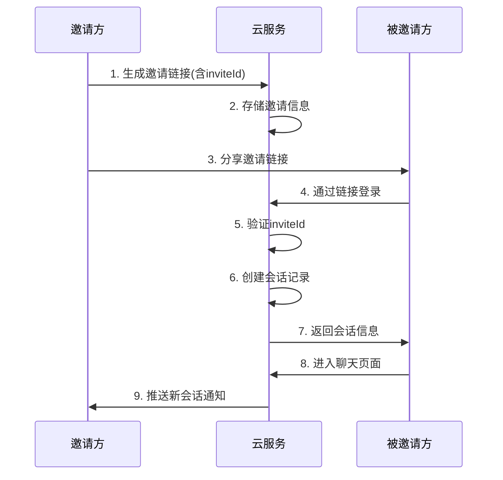

# 计划文件：秘信小程序邀请链接匹配问题解决方案

## 状态：[ ] 未完成

## 问题描述

当前秘信小程序存在邀请链接登录后双方无法匹配进入聊天页面的问题。根据分析，主要原因是：

1. 当前的邀请链接处理机制不完善，缺少正确的会话关联逻辑
2. 用户通过邀请链接登录后，没有正确加入到会话参与者列表
3. 缺少云函数间的协调机制，导致会话状态不一致
4. API层缺少处理邀请链接的相关方法

## 解决方案流程图



### 4. 创建邀请记录数据库集合

在云数据库中创建新的`invites`集合，结构如下：

```
invites {
  _id: String,           // 邀请ID
  createdBy: String,     // 创建者ID
  chatId: String,        // 关联的会话ID
  createdAt: Date,       // 创建时间
  expireTime: Date,      // 过期时间
  status: String,        // 状态：active/used/expired
  usedBy: Array<String>, // 使用过该邀请的用户ID列表
  usedCount: Number      // 使用次数
}
```

## 风险分析

1. **数据一致性问题**：如果在加入过程中发生错误，可能导致数据库状态不一致
   - 缓解措施：使用事务确保数据库操作的原子性

2. **链接安全问题**：邀请链接可能被恶意用户利用
   - 缓解措施：设置邀请链接有效期，添加使用次数限制

3. **并发问题**：多用户同时加入可能导致冲突
   - 缓解措施：利用云数据库的并发控制机制

## 实施步骤

1. 添加API层相关方法
2. 创建新的云函数处理邀请逻辑
3. 修改分享页面处理流程
4. 创建邀请记录数据库集合
5. 进行测试验证
6. 部署到生产环境

## 实施时间估计

- API层修改：0.5人天
- 云函数开发：1人天
- 页面逻辑修改：0.5人天
- 测试与调试：1人天
- 总计：3人天
