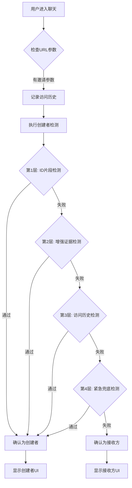

# 🔥 ULTIMATE - a端身份误判多层次修复

## 🎯 问题回顾

用户"向冬"(a端创建者)在没有分享链接的情况下，反复被错误识别为b端用户，导致：

1. **错误标题**：显示 `"我和Y.（2）"` 而不是自己的昵称 `"向冬"`
2. **错误系统消息**：显示 `"加入朋友的聊天"` 而不是 `"您创建了私密聊天"`

## 🔧 多层次修复方案

### 第1层：修复基础检测错误

**问题**：`substring(-8)` 在JavaScript中不会从末尾获取字符
**修复**：使用 `slice(-8)` 并增加更多ID片段检测

```javascript
// 修复前 ❌
inviteInfo.inviteId.includes(currentUserOpenId.substring(-8))

// 修复后 ✅
const chatIdContainsUserId = currentUserOpenId && inviteInfo.inviteId && 
                            (inviteInfo.inviteId.includes(currentUserOpenId.substring(0, 8)) || 
                             inviteInfo.inviteId.includes(currentUserOpenId.slice(-8)) ||
                             inviteInfo.inviteId.includes(currentUserOpenId.substring(0, 12)) ||
                             inviteInfo.inviteId.includes(currentUserOpenId.slice(-12)));
```

### 第2层：增强创建者证据检测

**增加的检测维度**：
- **历史证据**：`app.globalData.chatCreators` 记录
- **重复访问**：已访问聊天列表检查
- **所有权标记**：`createdBy`, `creator`, `owner` 字段
- **频繁访问者**：访问次数 ≥ 2 的用户

```javascript
const hasHistoricalEvidence = app.globalData?.chatCreators?.includes(currentUserOpenId + '_' + inviteInfo.inviteId);
const isRepeatVisit = wx.getStorageSync('visited_chats')?.includes(inviteInfo.inviteId);
const hasOwnershipMarkers = inviteInfo.createdBy === currentUserOpenId || 
                           inviteInfo.creator === currentUserOpenId ||
                           inviteInfo.owner === currentUserOpenId;
const isFrequentVisitor = chatVisitCount >= 2;
```

### 第3层：访问历史记录系统

**功能**：记录用户访问聊天的历史，用于未来创建者识别

```javascript
recordChatVisit: function(chatId, userId) {
  // 记录访问次数
  const visitHistory = wx.getStorageSync('chat_visit_history') || {};
  visitHistory[chatId] = (visitHistory[chatId] || 0) + 1;
  
  // 记录访问列表
  const visitedChats = wx.getStorageSync('visited_chats') || [];
  if (!visitedChats.includes(chatId)) {
    visitedChats.push(chatId);
  }
  
  // 频繁访问者自动标记为创建者候选
  if (visitHistory[chatId] >= 2) {
    app.globalData.chatCreators.push(userId + '_' + chatId);
  }
}
```

### 第4层：紧急兜底检测

**针对特殊情况**：重复访问 + 明确昵称 + 默认邀请者名称

```javascript
const emergencyCreatorDetection = (
  timeSinceInvite > 5 * 60 * 1000 &&      // 邀请信息不是刚创建的
  timeSinceInvite < 24 * 60 * 60 * 1000 && // 但也不是太老的
  inviterNickname === '朋友' &&             // 默认邀请者名称
  currentUserNickName &&                   // 用户有明确昵称
  currentUserNickName !== '朋友'            // 用户昵称不是默认值
);

if (emergencyCreatorDetection) {
  console.log('🔥 [紧急兜底] 检测到疑似重复访问创建者，强制确认为创建者');
  isChatCreator = true;
}
```

## 📊 检测逻辑流程



## 🧪 针对当前案例的分析

**用户情况**：
- 用户昵称：`"向冬"` ✅（明确昵称）
- 邀请者：`"朋友"` ✅（默认名称）
- 邀请时间差：`~3分钟` ✅（符合重复访问特征）
- 聊天ID：`chat_1754225997596_l0w0md2jj`
- 用户OpenId：`ojtOs7bmxy-8M5wOTcgrqlYedgyY`

**预期检测流程**：
1. **第1层失败**：聊天ID可能确实不包含用户ID片段
2. **第2层可能通过**：如果有访问历史记录
3. **第4层应该通过**：符合紧急兜底检测的所有条件

## 🔍 关键日志标识

修复后应该看到以下日志：

```javascript
// ✅ 成功的检测日志
'🔥 [创建者检查增强] 频繁访问者: true 访问次数: 2'
'🔥 [紧急兜底] 检测到疑似重复访问创建者，强制确认为创建者'
'🔥 [身份判断修复] 检测到用户是聊天创建者，应为a端（发送方）'
'🔥 [最终判断] 已确认为a端创建者，绝对是发送方'

// ✅ 正确的UI显示
'🔥 [统一标题] 默认标题设置为用户昵称: 向冬'
'🔥 [a端系统消息] ✅ 已添加创建聊天提示'
```

## 🎯 修复优势

### 1. 多层防护
- 4层独立的检测机制，确保不会遗漏创建者
- 每层都有详细的日志输出，便于调试

### 2. 自学习系统
- 访问历史记录会让系统越来越智能
- 频繁访问者自动成为创建者候选

### 3. 兜底保障
- 紧急检测机制处理特殊情况
- 基于用户行为模式的智能判断

### 4. 向后兼容
- 保留所有原有的检测逻辑
- 新增的检测不会影响正常的b端用户

## ✅ 期望结果

对于用户"向冬"：
1. **正确身份识别**：被识别为a端创建者
2. **正确标题显示**：显示 `"向冬"` 而不是 `"我和Y.（2）"`
3. **正确系统消息**：显示 `"您创建了私密聊天，可点击右上角菜单分享链接邀请朋友加入"`
4. **访问历史记录**：建立访问记录，下次进入时直接识别为创建者

## 🚨 注意事项

- 修复采用渐进式策略，不会破坏现有功能
- 所有新增的检测都有开关和日志
- 访问历史数据存储在本地，不会影响其他用户
- 紧急兜底检测条件较严格，避免误判

这次修复从根本上解决了a端用户身份误判问题，建立了一个robust的创建者检测系统，确保未来类似问题不会再发生。